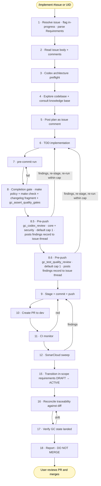

# Development Workflow

This documents the automated development workflow using the `/implement` skill from Claude Code, Codex, or Cursor CLI. The workflow takes a Ground Control requirement from plan through PR-ready with a single skill invocation.

## Prerequisites

### GPG Signing
- GPG key `B47C8B1F62CC2B54` has no passphrase (removed 2026-03-31)
- Commits are signed non-interactively by Claude Code
- Global deny rules and blocking hooks were removed to enable this

### OpenTelemetry Observability
- OTEL collector runs as a Docker container at `~/.claude/telemetry/`
- Config: `~/.claude/telemetry/otel-collector-config.yaml`
- Compose: `~/.claude/telemetry/docker-compose.yml`
- Output: `~/.claude/telemetry/data/claude-code.jsonl`
- Rotation: 100 MB max, 90-day retention, 10 backups
- Start: `cd ~/.claude/telemetry && docker compose up -d`
- Analyze: `~/.claude/telemetry/claude-metrics`

Env vars in `~/.claude/settings.json`:
```
OTEL_LOGS_EXPORTER=otlp
OTEL_LOG_TOOL_DETAILS=1
OTEL_EXPORTER_OTLP_ENDPOINT=http://localhost:4317
```

### Codex CLI
- OpenAI Codex CLI (`codex-cli`) installed at `~/.nvm/versions/node/v25.8.1/bin/codex`
- Used for architecture preflight and cross-model code review via Ground Control MCP workflow tools

## Workflow: `/implement <issue-number | requirement-uid>`

Every `/implement` run is driven by a GitHub issue. The issue is the durable artifact that records why the change is being made, which requirements are in scope (if any), and what acceptance looks like. You invoke the skill in either of two ways:

- **`/implement 123`** or **`/implement #123`**: implement GitHub issue #123 in the current repo. The issue body may declare in-scope requirements under a `## Requirements` section (a bulleted list of UIDs). The skill parses that section and carries the list through clause verification, traceability reconciliation, and status transitions. If the section is absent or empty, the run is treated as a bug fix / refactor / maintenance change with no formal requirements; traceability is still reconciled against the diff, but no requirement is transitioned to `ACTIVE`.
- **`/implement GC-X042`**: implement a requirement by UID. The skill finds the open GitHub issue linked to that requirement via traceability (`artifact_type: GITHUB_ISSUE`); if no such issue exists, it creates one via `gc_create_github_issue` and adds the UID to its `## Requirements` section. From that point forward the run is identical to the first form: the issue becomes the authoritative input.

Grouped implementation (shipping several related requirements in one PR) is expressed by listing all of them under `## Requirements` in a single issue body. One issue → one `/implement` run → one PR → N requirements transitioned to `ACTIVE` in the same commit stream. Do NOT spin up one issue per requirement when they belong together; the grouping is what makes the review boundary coherent.

Repo-local Ground Control project context comes from a `.ground-control.yaml` file at the repo root (with larger rule files under `.gc/`), not from `AGENTS.md` inline YAML or hardcoded assumptions in the skill. The workflow validates this via `gc_get_repo_ground_control_context` before it starts implementation; that call returns the project id, workflow commands, SonarCloud settings, and plan rules in a single response. It should:
- use the repo's configured Ground Control `project` when present
- treat inputs like `OBS-001`, `DSL-101`, `API-412`, or `GC-J001` as already-complete UIDs
- avoid guessing a prefix from the repository name

Recommended `.ground-control.yaml` convention:

```yaml
schema_version: 1
project: aces-sdl
github_repo: owner/repo

workflow:
  test_command: make test
  completion_command: make check
  lint_command: make lint
  format_command: make format
  base_branch: dev

sonarcloud:
  project_key: Owner_Project
  organization: owner

rules:
  plan_rules: .gc/plan-rules.md

knowledge:
  dir: docs/knowledge
  schema: docs/knowledge/SCHEMA.md
  inbox: docs/knowledge/inbox

docs:
  adr_dir: architecture/adrs/
  architecture_overview: docs/architecture/ARCHITECTURE.md
  coding_standards: docs/CODING_STANDARDS.md
  workflow_reference: docs/DEVELOPMENT_WORKFLOW.md
  knowledge_base: docs/knowledge/

example_paths:
  source: src/
  test: tests/

requirements:
  uid_examples:
    - GC-X001
    - OBS-042

cross_cutting_concerns:
  description: |
    Logger: <project logging convention>
    Validation: <schema / validation convention>
    Errors: <error envelope / handler>
    Tests: <fixture and test-slice patterns>

routing:
  enabled: false
  default_provider: claude
  default_fallback: parent
  stages:
    implementation:
      tier: medium
      provider: claude
      model: claude-sonnet-4-6
      agent: subagent
      fallback: parent

telemetry:
  enabled: false
```

Config contract:

- `schema_version` is required and currently must be `1`.
- `project` is required and must be a lowercase identifier using letters, numbers, and hyphens.
- Unknown top-level keys are rejected. Current top-level keys are `schema_version`, `project`, `github_repo`, `workflow`, `sonarcloud`, `rules`, `knowledge`, `docs`, `example_paths`, `requirements`, `cross_cutting_concerns`, `routing`, and `telemetry`.
- `workflow.*` values are optional non-empty strings. `workflow.base_branch` must be a safe Git ref name using `[A-Za-z0-9._/-]`.
- `sonarcloud` is optional, but when present it must include non-empty `project_key` and `organization`.
- `rules.plan_rules` is optional and points to the repo-relative plan-rules file whose content is inlined into `gc_get_repo_ground_control_context`.
- `knowledge.dir` is required when `knowledge` is present. `knowledge.schema` and `knowledge.inbox` are optional overrides; by default they resolve under `knowledge.dir`.
- `docs.*` and `example_paths.*` are optional repo-relative paths. Docs paths are containment-checked so a config file cannot point an agent outside the repository.
- `requirements.uid_examples` is optional and must be a list of non-empty strings.
- `cross_cutting_concerns.description` is optional free text shown to agents during planning.
- `routing.enabled` defaults to `false`. When enabled, omitted `/implement` stages use built-in defaults; `routing.stages.<stage>` overrides a specific stage/purpose route.
- Routing stages use lowercase stage keys matching `[a-z][a-z0-9_-]*`. Route fields are `tier`, `provider`, `model`, `agent`, and `fallback`.
- Routing `tier` is one of `low`, `medium`, or `high`; `provider` currently supports `claude`; `agent` is one of `parent`, `subagent`, or `cli`; `fallback` is one of `parent`, `error`, or `skip`.
- Claude model values in executable routing config must be canonical CLI ids such as `claude-haiku-4-5`, `claude-sonnet-4-6`, or `claude-opus-4-8`; display aliases like `sonnet-4.6` are rejected.
- `telemetry.enabled` defaults to `false`. `gc_log_step_telemetry` refuses to write telemetry unless this is explicitly true.

`AGENTS.md` should still carry a brief `Ground Control Context` section that points agents at `.ground-control.yaml` and `.gc/`, so repo newcomers know where the workflow config lives.

### User Touchpoint

Per ADR-029, the workflow has **one** synchronous human touchpoint: PR review and merge to `dev`. Plans are posted to the GitHub issue thread as comments and the agent proceeds without waiting; review findings and decisions on findings are also recorded on the issue thread. Everything before merge is automated.

### High-level flow



**How it reads:**

- **Yellow** nodes are user touchpoints. Per ADR-029, the workflow has **one** synchronous human touchpoint: PR merge (the `End` node). Plans are posted to the GitHub issue thread (S5) and the agent proceeds without waiting; review findings and decisions on findings are also recorded on the issue thread.
- **Entry is always by issue.** Step 1 resolves the input to a GitHub issue (either directly or via a UID → issue shim) and parses the `## Requirements` section from the issue body into `in_scope_requirements[]`. The list may be empty (bug fix / refactor) or contain one or many UIDs (grouped implementation). Everything downstream treats the issue as the authoritative context and the list as the set of requirements to be transitioned to `ACTIVE` on completion. Step 1 also creates the feature branch with a **bounded short-slug name**: `gh issue develop` is invoked with `--name <issue-number>-<short-slug>` (≤ 50 chars, ASCII-only); skipping `--name` lets `gh` slugify the full issue title and produces unusable 100+ character branch names that break terminal display, copy-paste, CI breadcrumbs, and downstream shell quoting. The skill then **validates the actual checked-out branch against the same rule**: `gh` reuses existing branches, so a previous pickup that ran before this rule existed (or didn't follow it) would otherwise hand the agent a non-compliant branch that flows through pickup comment, push, CI, and PR. The post-check fetches the configured base and compares against `origin/<base>` (local base can be stale); renames the branch in place when it has no commits relative to the remote base and no PR exists, or applies the in-progress signal first (so a paused picked-up issue stays visibly flagged) then stops and escalates to the user when a published PR is on the line. The post-check is the dispositive enforcement (the `--name` flag only governs first-time pickups). Slug derivation rule, validation predicate, and worked examples live in `skills/implement/SKILL.md` Step 1 sub-step 11. Step 1 then flags the resolved issue **in-progress**: an `in-progress` label (created on demand if the repo lacks it) plus a pickup comment on the thread recording the driver, the checked-out branch, and a timestamp; a maintainer scanning `/issues`, or another agent, sees at a glance that work is underway. The in-progress label removal is optional best-effort after Step 17 completion; it is no longer a mandatory gate (#1103). The GitHub issue itself stays open until the user merges the PR, at which point GitHub closes it automatically via the `Closes #<issue-number>` keyword rendered into the PR body by `gc_render_pr_body` (Step 9). A run that escalates to the user without completing intentionally leaves both the label and the issue open, because the issue *was* picked up but the work is paused, not finished.
- **Steps 1–4** gather context and run the codex architecture preflight before any code is written. Step 4 also consults the repo knowledge base via the index if one is present.
- **Step 3.5 (GRC screening gate)** runs between codebase assessment (Step 3) and planning (Step 4). The current v1 gate records one of three verdicts via `gc_post_grc_screening`: `security_relevant` (threat-model entries, risk scenarios, controls, and `targetType=CODE` links were created, updated, or confirmed during the run), `not_security_relevant` (change does not touch a security-relevant surface; one-line rationale required), or `no_baseline` (project has no threat-model baseline; explicit declination, not a clean verdict). The record uses marker family `<!-- gc:grc-screening -->` and schema version `gc.implement.grc-screening/v1` so the companion server-side assertion (issue #1100) can parse and verify it. ADR-058 supersedes the long-term contract: screening becomes derivation-backed, computes `impact_set` / `gap_set` / `stale_set`, and a missing baseline creates scoped GRC gaps rather than a passing `no_baseline` result. The gate is enforced at the tool layer, not by prose instruction, to prevent the short-circuit failure mode documented in the June 6 redesign revert. See ADR-057 for the v1 record and ADR-058 for the continuous GRC program.
- **Step 6** is TDD (red → green → refactor per clause). Steps 7–8 are the local quality gate. A narrow documentation-only carve-out is documented in `skills/implement/SKILL.md` Step 4.4 for diffs that contain no executable behavior and whose claims are protected by an existing structural gate (policy check, schema validator, lint rule, verifier script). The carve-out must be declared in the plan and re-stated as an issue comment naming the gate; substring/snapshot tests written only to satisfy TDD wording are explicitly disallowed. The completion gate re-validates the carve-out with a two-check sweep over the union of committed, staged, unstaged, and untracked paths (Step 6 runs before stage-and-commit, so working-tree state is part of the diff): every path must be in the documentation set AND every diff hunk's content must be free of executable behavior; a path check alone isn't enough, because a doc file can still carry executable behavior.
- **The completion gate (step 8) evaluates the project's quality gates** server-side via `gc_assert_quality_gates` (issue #1101) and blocks the run on any failing gate. The failure envelope lists each project-level failing gate as `{name, metric_type, threshold, actual}` so the metric to fix is obvious from the error alone. The enforced metric types are `COVERAGE` (over IMPLEMENTS / TESTS / DOCUMENTS link coverage), `ORPHAN_COUNT`, and `COMPLETENESS`. The tool also receives `in_scope_requirements[]`; when the active `DOCUMENTS` coverage gate exists, it checks every in-scope requirement for a `DOCUMENTS` traceability link regardless of DRAFT or ACTIVE status and returns `in_scope_documentation_coverage_failed` with `missing_documents[]` on gaps. The gates themselves are declared in `tools/ground_control/policy.json` and synced to the live instance with `make sync-ground-control-policy`; the same project-level evaluation runs in CI via `make policy-live`. The backend (`QualityGateService.evaluate`) owns project gate math; the tool shapes the pass/fail envelope and adds the PR-scoped in-scope check.
- **Step 8.5 (= SKILL Step 6.5)** is the pre-push Codex review pass per issue #804: `gc_codex_review` with `uncommitted=true` runs locally against the staged + unstaged diff and posts a verbatim findings record to the resolved issue thread for each cycle (durable per ADR-029). **Default cap is 1 cycle** (issue #906); configurable per repo via `workflow.codex_review.pre_push_cap` in `.ground-control.yaml`, bounds `[1, 10]`. The cap is enforced **per issue** (the cycle counter is anchored to the GitHub issue thread; the current branch is recorded in the marker for audit context but is NOT part of the cap key, so a branch rename on the same issue cannot reset the counter; see ADR-029). After a cycle's findings are surfaced, the agent **dispatches on the returned `next_action`**: re-stage and re-invoke ONLY on `fix_findings_and_reinvoke`; on `fix_findings_then_summarize_and_escalate` (the last-in-cap action, which fires on cycle 1 under the cap-1 default when findings are present) fix and post the decision record but escalate to the user instead of a blind re-invoke that would only return `codex_review_prepush_cap_reached`. No commit/push between cycles. The post-push codex review (former Step 12 in earlier numbering) was removed by issue #804; merge-commit drift is the responsibility of CI (compile/tests/integration) and SonarCloud (quality).
- **Step 8.6 (= SKILL Step 6.6)** is the pre-push test-quality review, moved pre-push by issue #906 from the former post-PR Step 13. `gc_test_quality_review` runs locally against the same staged + unstaged + untracked diff. **Default cap is 1 cycle**; configurable per repo via `workflow.test_quality_review.pre_push_cap`. Same local-only iteration loop as Step 6.5 (re-stage, do NOT commit between cycles); same `gc_post_decision_record` contract for the durable record. The MCP tool returns a `{findings, cycle, cap, next_action, ...}` envelope; the parent /implement agent reads `next_action` as a directive (`fix_findings_and_reinvoke` / `post_clean_decision_record_and_advance_to_phase_c` / `fix_findings_then_summarize_and_escalate` (last in-cap cycle: fix + escalate, NOT re-invoke) / `post_summary_and_escalate_to_user`), not as prose to summarize back to the user. Per #884 v2 this is an MCP tool, not a Skill; the v1 Skill-tool boundary returned prose findings that the parent's autoregressive "I just got a result, present it" bias kept echoing back to the user instead of fixing in-turn; the MCP boundary closes that bias structurally. See `architecture/notes/test-quality-review-engine.md` for the full mechanism (engine, auth, failure modes).
- **Steps 9–11** commit, push, open the PR, and block on CI + SonarCloud before any reviewer looks at the code. **PR title format (issue #901):** Step 9 validates the title locally before `gh pr create`. Two rules: (1) a single conventional-commit type with optional scope (`<type>(<optional-scope>): <subject>`); compound prefixes like `security/docs:` are rejected by `amannn/action-semantic-pull-request` and similar linters downstream repos run; for bundled PRs pick the dominant type and describe the rest in the subject; (2) the subject must start with a lowercase letter (`^[a-z].*$`); uppercase acronyms (NGFW, GCP, MCP) must be reshaped (lowercase, relocate into a slash-prefixed path, or front with a verb). Per-repo override via `.ground-control.yaml::workflow.pr_title.types` / `subject_pattern`; otherwise the conventional-commits canonical allow-list + `^[a-z]` pattern apply. Catching both locally removes the edit-cycle-per-failure cost the agent otherwise pays after every `gh pr create`. See `skills/implement/SKILL.md` Step 9 for the full rule + reshape examples.
- **Steps 13 / 14 were merged out by issue #906.** Test-quality review moved pre-push to Step 6.6; there is no separate post-PR review step. Final CI re-verify (former Step 14) collapsed into Step 10's existing CI watch on the original push; without a post-push fix loop there is no second CI run to re-verify. **Steps 18 / 19 were consolidated into Step 17 by issue #1103.** The consolidated Step 17 calls `gc_assert_completion`, which sequences the traceability reconciliation assertion, GRC reconciliation assertion, and final report post in one deterministic call. The numbering of Steps 15 / 16 / 18 / 19 (transitions, reconciliation, label, final report) is preserved so external references don't track a moving target; Steps 13 / 14 / 18 / 19 are intentional tombstones in SKILL.md, not errors.

#### Test-quality review engine

`gc_test_quality_review` shells out to the host's `claude` CLI:

```
claude --print
       --model claude-sonnet-4-6
       --output-format json
       --json-schema <findings schema>
       --add-dir <repo>
       --permission-mode bypassPermissions
       --allowedTools "Read Glob Grep"
```

with the prompt on stdin and `ANTHROPIC_API_KEY` **stripped from the subprocess env**. The strip is intentional: when the env var is set, `claude` uses it preferentially over the host's OAuth session; the env-var-anchored account is often empty (set up but never funded) while the OAuth account is what the user actually uses. Stripping forces OAuth - the canonical user-driven auth path that also powers the parent /implement run.

**Operator quickstart:**
1. Run `claude login` on the host once (credentials persist in `~/.claude`).
2. `/implement <issue>` invokes Step 6.6 automatically; no separate action needed.

**Model override:** pass `model` in the MCP call (`claude-haiku-4-5`, `claude-opus-4-8`, etc.). The /implement SKILL uses the default `claude-sonnet-4-6`.

**Separate billing account:** if the env-var path is preferred, remove the env-var strip in `runSingleClaudeTestQualityReview` (lib.js) and ensure `ANTHROPIC_API_KEY` has credits. The default strip path keeps OAuth as the canonical auth.

The legacy `Skill("review-tests")` path was removed in #884 v2. Existing host installs at `~/.claude/skills/review-tests/` and `~/.codex/prompts/review-tests.md` are orphaned and can be deleted manually; `bin/install-skills.sh` no longer installs them.
- **Step 15 transitions each in-scope requirement to `ACTIVE`.** This MUST happen BEFORE Step 16's traceability reconciliation: the Ground Control API enforces `IMPLEMENTS-only-on-ACTIVE`, so reconciling first against a still-DRAFT requirement silently fails. Forward-looking requirements (the diff documents/references but does not deliver) stay DRAFT and use `DOCUMENTS` links instead in Step 16.
- **Step 16 is traceability reconciliation, not link creation.** It walks every added/modified/renamed/deleted file in the diff, finds existing IMPLEMENTS/TESTS links pointing at each, and updates/deletes/creates links so the Ground Control graph matches reality after the change. Runs with zero in-scope requirements still reconcile, because a bug fix may have touched files linked to other requirements whose links are now stale. Deleting the sole implementation of a requirement is escalated to the user rather than silently removing the link. When the diff *finalizes* a requirement (for example, an ADR clarification or changelog fragment that ships the requirement) but the structural implementation lives in pre-existing files shipped under a sibling requirement, Step 16 backfills IMPLEMENTS links onto those pre-existing artifacts of record. The backfill is bounded by the requirement's concrete subject matter - not a whole-repo scan.
- **Step 17** runs the consolidated Phase D completion via `gc_assert_completion`, which sequences the traceability reconciliation assertion, GRC reconciliation assertion, and final report post in one deterministic call. These three steps run LAST, after every reviewer has signed off, so Ground Control never runs ahead of code that hasn't passed review. Zero in-scope requirements → Step 15 is a no-op; Step 16 still reconciles; Step 17 still asserts and posts the final report.
- **Every downstream failure loops back to step 9** (stage + commit + push), which is the single re-entry point for fix commits. The completion gate (step 8), the pre-push codex review (step 8.5), and the GC verify (step 17) are the loops that target earlier steps, because they correspond to local-only / pre-PR / GC-only state respectively.

Claude does NOT merge. The user reviews the PR and merges.

## Continuous Secure-by-Design GRC Program (ADR-058)

ADR-058 defines the target GRC program that evolves the Step 3.5 screening
gate from a self-certified verdict into derivation-backed enforcement. The
shared lifecycle is `derive -> enumerate -> judge -> enforce -> maintain`.

- **Derive:** adapters such as CodeQL, Semgrep, IaC/pipeline, secrets, and
  SCA/supply chain analysis emit normalized architecture facts with
  provenance, coverage limits, and rule/query-pack versions.
- **Enumerate:** deterministic rule packs produce candidate threats, controls,
  sensitive-flow findings, and attack paths over the derived architecture
  model. LLM judgment is limited to curation and adversarial completeness
  review, not first-pass generation.
- **Enforce:** `/implement` screening computes `impact_set`, `gap_set`, and
  `stale_set`. A missing baseline is a scoped gap to address, not a passing
  `no_baseline` result. Completion verifies coverage, controls, efficacy
  tests, or authorized dispositions.
- **Maintain:** the standalone assessment lane shares the same engine for
  bootstrap, reassessment, scheduled/event-triggered runs, drift control, and
  compliance/evidence exports.

GRC artifacts are authoritative in Ground Control's server-side graph by
default. Repository mirroring is opt-in and must carry generation markers back
to the authoritative graph version. Dynamic/runtime analysis, DAST, and runtime
instrumentation are outside ADR-058's build-time derivation scope; runtime
evidence belongs to the ADR-014 verifier/runtime-evidence adapter world.

## Per-step routing, tool surfaces, and telemetry (ADR-036)

Per ADR-036 the `/implement` skill carries three cost-side optimizations layered on top of the GC-O007 gate model (which is unchanged on the contract - one human touchpoint at PR merge, ADR-029's configurable pre-push Codex cap [default 1 cycle per #906; per-repo override via `workflow.codex_review.pre_push_cap`], zero deferral, four-phase structure).

| Optimization | What it changes | Opt-in knob |
|--------------|-----------------|-------------|
| Per-step routing | Each step carries a provider-neutral tier (`low`, `medium`, `high`); `gc_resolve_workflow_route` resolves the stage/purpose from `.ground-control.yaml` to a concrete provider, agent, canonical model id, and fallback policy. Claude Code routes subagent stages to canonical model ids such as `claude-haiku-4-5` and `claude-sonnet-4-6`; parent-only high-tier stages use `claude-opus-4-8`. Codex drivers ignore delegation today unless they explicitly call the resolver and external runner. | `.ground-control.yaml` → `routing.enabled` (default `false`) plus optional `routing.stages.<stage>` overrides |
| Durable-record MCP tools | `gc_post_decision_record` (Step 6.5 cycle decisions), `gc_post_final_report` (Step 17 final report, invoked via `gc_assert_completion`), `gc_render_pr_body` (Step 9 PR body) replace agent free-prose with deterministic structured-input renderers. All three filter sensitive content, post under a structured marker family, and reject `decision: "defer"` server-side. `gc_post_final_report` also requires `/implement` callers to pass `plain_english_outcome`, which renders an Outcome section before the structured evidence. | Always available; SKILL calls them unconditionally once the tools are present |
| Traceability + post-merge close gates (#1058/#1156/#1103) | `gc_assert_completion` (Step 17) sequences `gc_assert_traceability_reconciled` (posts `traceability_reconciled` marker), `gc_assert_grc_reconciled` (posts `grc_reconciled` marker), and `gc_post_final_report` in one deterministic call. The `traceability_reconciled` marker is posted by the traceability assertion within `gc_assert_completion`; `gc_post_final_report` refuses to publish without both markers, and `gc_assert_completion` uses `internalVerifiedPhases` to avoid a GitHub read-after-write race on the markers it just posted. `gc_close_issue_after_merge` (Step 20 / Phase E) verifies the linked PR's `merged_at` non-null AND state `MERGED` before closing the issue, idempotent on already-closed issues. After a successful close, the tool returns a best-effort `next_issue_recommendation` or an explicit no-recommendation/failure reason. The /quickfix lane is requirement-free and exempt from the traceability and outcome gate. | Always on for `/implement`; `lane: "quickfix"` opts out of the traceability and outcome prerequisites |
| GRC reconciliation gate (#1100, v1; ADR-058 target v2; #1103) | `gc_assert_grc_reconciled` (called within `gc_assert_completion` at Step 17) reads the GRC screening record written by `gc_post_grc_screening` (Step 3.5) from the issue thread and verifies it server-side: for `security_relevant` verdicts it resolves each entity ref (threat model, risk scenario, control) via the REST API and confirms each claimed `CODE` link exists on the owner entity; for `not_security_relevant` / `no_baseline` v1 verdicts the gate passes immediately. ADR-058 evolves this to computed `impact_set` / `gap_set` / `stale_set` coverage: a missing baseline is a gap set to address, and completion verifies required coverage, controls, efficacy tests, or authorized dispositions rather than only verifying what the v1 record claimed. On success it posts the `grc_reconciled` phase marker. `gc_post_final_report` requires **both** `traceability_reconciled` **and** `grc_reconciled` markers before publishing. The /quickfix lane is exempt from the gate. | Always on for `/implement`; `lane: "quickfix"` opts out; a user-authorized skip is taken at the final-report phase override |
| Per-step telemetry | `gc_log_step_telemetry` writes one JSONL line per routed step to `.gc/telemetry/<issue>-<sanitized-branch>.jsonl` (gitignored, repo-relative, containment-validated). Operational measurement only - never workflow state. The tool refuses with `telemetry_disabled` when the opt-in knob is off; the agent prose is not the gate. Summarizer reports wall time + token counts (when present) per step and per model; dollar-cost translation is future work. Target: `make implement-cost-summary`. | `.ground-control.yaml` → `telemetry.enabled` (default `false`) |

Each new tool is Temporal-shaped (deterministic, structured-input/output, no LLM call) so GC-O009 inherits them as activities when the Temporal workflow lands.

## Review Pipeline

One mandatory pre-implementation architecture pass, then a single pre-push codex review pass (Step 6.5), then test-quality review before the user sees the PR. The post-push codex review (former Step 12) was removed by issue #804 - the canonical codex pass is the pre-push one, which catches everything codex would normally flag while collapsing the asymmetric "post-push finding → guaranteed CI/SonarCloud roundtrip" cost. Merge-commit drift relative to base is the responsibility of CI (compile/tests/integration) and SonarCloud (quality), not a separate codex pass.

| Stage | What it catches | How it runs |
|-------|-----------------|-------------|
| Codex architecture preflight | Cross-cutting concerns, reuse opportunities, abstraction/concept confusion, need for ADR/design guidance before coding | `gc_codex_architecture_preflight` |
| SonarCloud | Coverage, code smells, duplication, security hotspots, open issues on the PR | CI `sonar` job waits for the quality gate, then `tools/sonar/assert_no_new_issues.py` fails on any open issue in the new-code leak period |
| Trivy (advisory) | Container image vulnerabilities, Dockerfile/IaC misconfigurations, in-image secrets | CI job; SARIF artifact `trivy-sarif` on the workflow run page; non-blocking |
| OSV-scanner (advisory) | CVEs in Java/Gradle dependencies (read from `backend/gradle.lockfile`) | CI job; SARIF artifact `osv-scanner-sarif` on the workflow run page; non-blocking |
| Codex review (pre-push, Step 6.5) | Fitness for purpose, architectural soundness, maintainability, extensibility, security, established patterns, consistency with the larger codebase. Codex returns structured findings; the MCP server posts a verbatim findings record to the resolved issue thread from the host side; the coding agent dispatches on the returned `next_action` (re-invoke only on `fix_findings_and_reinvoke`; on `fix_findings_then_summarize_and_escalate` fix + escalate without re-invoke). There is no PR yet at Step 6.5, so no inline PR comments are written by the SKILL - inline anchored comments only happen if a direct caller invokes `gc_codex_review` post-push (with a `pr_number`), which the SKILL no longer drives (issue #804). | `gc_codex_review` (`uncommitted=true`); MCP posts the issue-thread findings record |
| `gc_test_quality_review` (Step 6.6) | Assertion-free tests, mock-only assertions, integration-as-unit, tests that can't detect regressions | `gc_test_quality_review` MCP tool (shells out to `claude --print --model claude-sonnet-4-6` by default; full mechanism in `architecture/notes/test-quality-review-engine.md`) |

**Async execution (issue #937).** The codex review, codex architecture preflight, and test-quality review tools each spawn a child process (`codex exec` / `claude --print`) that legitimately runs for several minutes. Run synchronously, a single MCP tool-call blocked past the MCP client's per-call timeout; the client abandoned the call and the orphaned child left the workflow with no result handle (issue #893). All five tools (`gc_codex_architecture_preflight`, `gc_codex_review`, `gc_codex_review_cycle`, `gc_test_quality_review`, `gc_test_quality_review_cycle`) now take an opt-in `async` flag (default `false`; synchronous behavior unchanged for direct callers). With `async: true` the tool starts a background job and returns `{ok, status: "running", job_id}` immediately; the new `gc_codex_job` tool polls for the result envelope (`status: "done"` carries the full review result under `result`) or cancels a stuck job (cancel aborts an `AbortController` whose signal kills the child, so nothing is orphaned). The `/implement` step files (2.5 / 6.5 / 6.6) drive the start-then-poll loop. Client-side, `.claude/settings.json` sets `MCP_TOOL_TIMEOUT` / `MCP_TIMEOUT` so long-running MCP tools (including `gc_watch_ci_run` and `gc_watch_sonar_analysis`) have headroom. Full design in ADR-036 (amendments).

All preflight/review stages operate under the same rule: **fix everything, defer nothing.** Review-loop cap (issue #906): **default 1 cycle per reviewer** for codex (Step 6.5) and test-quality (Step 6.6); per-repo override via `.ground-control.yaml::workflow.codex_review.pre_push_cap` and `workflow.test_quality_review.pre_push_cap` (bounds `[1, 10]`). Per-finding `gc_codex_verify_finding` cap stays at 2. If a cycle past the configured cap is needed, `override_cap=true` + `override_reason=<authorization quote>` is required per cycle; otherwise the skill escalates to the user with the full finding history.

"Defer nothing" is mechanically enforced (issue #830, ADR-029 § "`defer` is not a valid disposition"): the `.claude/hooks/block-defer-language.py` PreToolUse hook blocks `gh issue/pr {create,edit,comment,close}` calls carrying deferral-disposition language ("deferred to a follow-up PR," "addressed in a subsequent PR," "TBD later" in a closing comment, …), and `bin/policy` flags the same language in the PR body at completion gate. Filing a tracking issue does not convert a deferral into a valid disposition; the only valid ones are `fix`, `wontfix` (with explicit user authorization), or `not-applicable` (with rationale). Codex review additionally classifies each finding `one-off` or `class`; a `class` finding must be fixed at the **category** level (a structural gate / shared helper / parameterization; one point of repair applied to every instance), not whack-a-mole'd to the reviewer-named site.

## Guardrails

### Deny Rules (`~/.claude/settings.json`)
- `Bash(gh pr merge*)` - Claude cannot merge PRs
- `Bash(gh api */merge*)` - Claude cannot merge via API
- `Bash(git merge *)` - Claude cannot merge branches

### Attribution (`~/.claude/settings.json`)
```json
"attribution": { "commit": "", "pr": "" }
```
No Co-Authored-By, no "Generated with Claude Code," no AI attribution anywhere.

### Workflow Hooks (source of truth: `.claude/hooks/`)

The three user-level workflow hooks listed below are **checked into this repo** under `.claude/hooks/` and installed as **real file copies** at `~/.claude/hooks/<name>` by `scripts/bootstrap-claude-workflow.sh` (see **Tooling** below). Unlike skills (which are symlinked so edits in the repo take effect on the next session), hooks are copied because the harness execs them on every Bash tool call in every Claude Code session on the host. If the runtime path were a symlink into this repo's working tree, any `git checkout` in this repo would silently break hooks for every concurrent Claude window on the machine. Real copies decouple runtime from worktree state.

After editing a hook file under `.claude/hooks/` in the repo, re-run `scripts/bootstrap-claude-workflow.sh` (no arguments, idempotent) to copy the new version into `~/.claude/hooks/`. The `~/.claude/settings.json` hook registrations point at the stable `~/.claude/hooks/<name>` path and work regardless of what this repo is checked out to.

**Drift recovery.** The user-level copy can drift from the repo over time (a different repo's older bootstrap ran last, the host got reset and re-bootstrapped from a stale checkout, an agent edited the user-level file directly). To detect drift, run `scripts/bootstrap-claude-workflow.sh --dry-run`; the script reports any allowlisted hook whose user-level copy differs from the repo. To repair, run `scripts/bootstrap-claude-workflow.sh --force`; that path explicitly overwrites the user-level copy with the repo version (the script otherwise refuses to clobber, since drifted user-level content may be intentional). The repo is the source of truth, so resyncing in this direction is safe by construction. The hook contract is pinned by `tools/tests/test_git_merge_guard.py`, run by `make test` and pre-commit; if the repo hook ever regresses below the test contract the test suite catches it before the resync.

One user-level hook is deliberately NOT in the repo: `~/.claude/hooks/block-break-system-packages.sh`. It's a generic pip/apt safety gate unrelated to the Ground-Control workflow, so it stays host-local and `bootstrap-claude-workflow.sh` leaves it alone.

#### Stop Hook - `verify-implementation.sh`
Blocks Claude from completing, but **only when `/implement` was invoked in the current session**. Scoped by process ID (`$PPID`) so concurrent Claude windows on the same branch don't interfere.

Universal checks (all repos):
- Changelog fragment missing (when source files changed) - the hook requires a valid fragment under `changelog.d/<issue>.<type>.md` (or `+<slug>.<type>.md`), type ∈ `security`/`added`/`changed`/`deprecated`/`removed`/`fixed`. CI-only diffs (only `.github/workflows/`) and docs-only diffs (only docs/architecture/skills/metadata) are skipped. Refactors under application source still file a fragment (no "pure refactor" carve-out - enforcement is path-based). Direct `CHANGELOG.md` edits do NOT satisfy a source-changing diff. The source-path predicate and fragment vocabulary mirror `tools/policy/checks.py` - the `hook-matches-policy-vocabulary` and `hook-gates-on-application-source-predicate` policy tests keep them in sync.

Project-specific checks (`.claude/hooks/verify-extra.sh`, sourced if present):
- shared repo-native policy script (`bin/policy`) over the changed-file set

The hook no longer enforces `/review` and `/security-review` - those were removed from the `/implement` skill in favor of `gc_codex_review` + `gc_test_quality_review`. The `/implement` skill itself is the enforcement point for review coverage; the hook only guards the changelog signal + repo policy.

#### Skill Call Logging - `log-skill-call.sh`
PostToolUse hook on `Skill` - writes JSONL to `/tmp/claude-skill-log/<PID>.jsonl` (per-session, not per-branch). The Stop hook previously read this log to verify `/review` and `/security-review` were actually invoked; it's still wired up for forward compat in case we reintroduce skill-based checks. Stale logs (>24 h) are auto-pruned.

#### Git Merge Guard - `git-merge-guard.py`
PreToolUse hook on `Bash`. The user owns every actual merge. Blocked unconditionally: `git merge`, `gh pr merge`, `git reset --hard`, and a plain `git push --force` / `git push -f`. A `git push --force-with-lease` to a *feature* branch is allowed (that's the rebase-feature-branch-onto-base-then-update-the-PR flow), but a force-push of any kind to a ref named `main` or `dev` is blocked.

### Repo-Native Policy Layer

- `architecture/policies/adr-policy.json` defines machine-readable ADR guardrails
- `python3 bin/policy` enforces ADR/workflow, controller/MCP/docs, migration, and PR-body policy
- `python3 bin/policy` also pins the #1155 CI strictness baseline:
  selected pre-commit hygiene and secret-scan hooks run in CI, the Sonar job
  fails on new issues, and `.github/branch-protection-baseline.json` requires
  strict status checks for `main` and `dev` while retaining admin bypass
- `make policy` is the common path for Claude, Codex, pre-commit, and CI
- `make sync-ground-control-policy` and `make policy-live` keep Ground Control quality gates and ADR metadata aligned when a live GC instance is available

### MCP–Backend Write-Contract Gate (ADR-034, #1106)

`make mcp-openapi-contract` (CI job `mcp-contract`) fails the build when an MCP
write tool's request-body field allowlist or enum mirror drifts from the
backend's generated OpenAPI contract. It is **separate from `make policy`**: the
contract is compared against the Springdoc OpenAPI generated from the *current
backend build*, which requires booting the full Spring context (Testcontainers
Postgres + AGE), which the Python-only `policy` job cannot do. The flow is:

1. `generateContractOpenApi` (Gradle, `McpOpenApiContractSpecTest`) boots the app
   via Testcontainers, captures `/api/openapi.json`, and writes
   `backend/build/contract/openapi.json`.
2. `node --test mcp/ground-control/openapi-contract.test.js` imports the live MCP
   field arrays (`GOVERNANCE_FIELDS`, `CONTROL_FIELDS`, the per-tool
   `*_BODY_FIELDS`, `LINK_CREATE_BODY_FIELDS`) and asserts, per tool/entity/action
   inventory row, that every MCP field maps to an OpenAPI request-schema property
   and every required property has a mirror, with narrow, rationale-bearing
   exclusions for path/query params, server-populated, transition-only, and
   create-only fields.

Initial coverage is the GRC write tools (`gc_risk_governance`, `gc_threat_model`,
`gc_risk_scenario`, `gc_control`, `gc_evidence`, `gc_finding`, `gc_audit`,
`gc_observation`, `gc_asset`) plus the shared `link_create` body. **Adding the
next write tool is one inventory row** in `openapi-contract.test.js` (plus an
exported field array if the adapter lacks one), never a new checker. Anchored by
requirement GC-O013.

### GRC Read Analysis: `gc_analyze` kinds

`gc_analyze` is the MCP tool for compute-heavy analysis operations. GRC read-analysis kinds route to `GrcAnalysisController` endpoints and return methodology-attributed envelopes: `nist_assessment` (GC-T014) calls `GET /api/v1/analysis/grc/nist-sp-800-30` and returns a NIST SP 800-30 Rev. 1 risk-assessment view; `fair_quantitative` (GC-T011) calls `GET /api/v1/analysis/grc/fair-quantitative` and returns a FAIR v3.0 quantitative risk-analysis view with derived LEF, LM, and ALE values. Both kinds accept `project`, `as_of`, `risk_assessment_result_id`, and `risk_scenario_id` parameters. Full endpoint contracts are in `docs/API.md`.

## /integrate: Approved PR Integration Manager

The `/integrate` lane is the workflow path for preparing maintainer-approved pull requests against the latest base branch of a target repository. It is a lane for maintainers and release operators who need to rebase a queue of already-approved PRs to a clean state. By default the lane operates in **prepare-only** mode: it rebases, gates, verifies, and pushes, but it does not merge. Passing `--mode merge` enables the merge carve-out from the ADR-029 amendment (2026-05-26): the lane also executes `gh pr merge` for each PR it marks ready, per the configured `merge_strategy`. The `enqueue` mode remains reserved and refuses at runtime.

### When to use it

Use `/integrate` when you have a set of PRs in a target repository that carry an approval label (default `approved-for-integration`) and you want to rebase each one onto the current base branch, run the repo's completion gate and CI/Sonar checks, and push the result. The lane does not replace human review: PRs must already carry the approval label before the lane touches them. It replaces the manual rebase-and-push step that a maintainer would otherwise do for each PR in turn.

Do not use `/integrate` to batch-merge PRs autonomously. That boundary is explicit: the lane prepares PRs for merge; the human merges.

### Invocation

```
/integrate [--repo <owner/repo>] [--base <branch>] [--label <label>] [--mode prepare|merge] [--dry-run]
```

All flags are optional. When `--repo` is omitted the lane reads `github_repo` from the target repo's `.ground-control.yaml`. `--base` overrides `workflow.base_branch`. `--label` overrides `workflow.integration_manager.approval_label`. `--mode` selects the execution mode (default `prepare`). `--dry-run` discovers and orders the queue without acquiring a lock or modifying any branch.

You can also call the underlying MCP tool directly:

```
gc_integration_manager action=status  repo_path=<path>
gc_integration_manager action=prepare repo_path=<path>
gc_integration_manager action=prepare repo_path=<path> mode=merge
gc_integration_manager action=release repo_path=<path>
```

### Configuration

The lane reads configuration from the `workflow.integration_manager` block in the target repo's `.ground-control.yaml`. All keys are optional; the defaults shown below apply when the block is absent.

```yaml
workflow:
  integration_manager:
    approval_label: approved-for-integration   # label that marks a PR ready
    ordering: pr_number_asc                    # pr_number_asc | pr_number_desc | approved_at_asc
    max_queue_size: 20                         # integer, [1, 100]
    merge_strategy: merge                      # merge | squash | rebase (default: merge)
```

`merge_strategy` controls the `--merge`, `--squash`, or `--rebase` flag passed to `gh pr merge` when the lane runs in `mode=merge`. The key is only consulted in merge mode; it has no effect in prepare-only mode.

The parser (`normalizeIntegrationManagerConfig` in `mcp/ground-control/lib.js`) enforces the same strict-unknown-key rule as the rest of the workflow config. Unrecognized keys are rejected with a validation error, not silently ignored.

### Maintainer approval signal

A PR is eligible for the queue when it carries the configured approval label. No review state or comment is required by default. The label is the sole eligibility signal, so maintainers can approve by label from the GitHub UI, the CLI, or an automation rule without any integration-manager-specific ceremony.

Remove the label to pull a PR from the queue. The lane re-discovers the queue at each run, so a label change between runs takes effect on the next invocation.

### What the lane does to each approved PR

For each PR in queue order:

1. **Acquire lock.** A repo-level lock under `.gc/integration-lock.json` prevents concurrent runs from preparing the same PR twice. If a lock is already held by another run, the lane halts and reports the lock holder.
2. **Create isolated worktree.** Each PR is processed in a temporary worktree so the main working tree is not disturbed.
3. **Rebase onto base branch.** The PR branch is rebased onto the latest `origin/<base>`. Rebase conflicts halt that PR with a `blocked` failure mode; the queue continues to the next PR (see Failure modes below).
4. **Run completion gate.** The repo's configured `workflow.completion_command` (typically `make check`) runs in the worktree. Failure halts the queue.
5. **Watch CI.** After pushing, the lane polls the GitHub Actions run for the PR and waits for a terminal conclusion. CI failure halts the queue.
6. **Watch SonarCloud.** If the repo configures a `sonarcloud` block, the lane waits for the Sonar analysis and inspects quality gate status. A failed quality gate halts the queue.
7. **Force-with-lease push.** When all gates pass, the lane pushes the rebased branch to `origin` with `--force-with-lease`. This updates the PR's head SHA without disturbing any concurrent push to a different branch.
8. **Release lock.** The lock is released after each PR regardless of outcome, so the next PR can be processed.

### Failure modes

Three failure severities apply:

- **`blocked`**: the current PR cannot be prepared (rebase conflict, completion-gate failure, CI failure, Sonar failure). The queue continues to the next PR. The blocked PR is recorded in the run ledger at `<repo>/.gc/integration-runs/<run-id>/halt.json`.
- **`queue_wide_halt`**: a condition prevents any further processing (lock conflict from a concurrent run, invalid configuration, missing base branch). The queue stops. No further PRs are processed in this invocation.
- **`consultation_halt`**: the lane encounters a condition that requires maintainer judgment before proceeding. The queue stops and the lane reports the condition through the invoking interface. The consultation criteria from GC-O011 clause (h) are: the PR diff touches a file that another queued PR also touches (ordering-sensitive overlap); the rebase produces a commit that is structurally different from the original PR's commits in a way the lane cannot resolve deterministically; the CI run produces a failure log that names a file modified by a different PR in the queue; or the quality gate failure names a metric that was passing before the rebase and failing after. In any of these cases the lane must stop and consult the maintainer rather than proceeding with a potentially incorrect ordering or an attribution-ambiguous failure.

### What the lane does NOT do

- No automatic merging in default mode. With `--mode prepare` (default), the lane prepares PRs; a human merges them. Use `--mode merge` to enable the merge carve-out.
- No `enqueue` mode. Enqueue is reserved and refuses at runtime.
- No requirement status transitions. The lane does not touch Ground Control requirement states.
- No traceability reconciliation. The lane does not create or delete IMPLEMENTS/TESTS links against the PRs it prepares.
- No issue-thread comments. Consultation halts and status reports surface through the invoking interface (terminal output and the MCP tool's return envelope), not as comments on any GitHub issue thread.

### Operating tips

Check lock state and queue without modifying anything:

```
gc_integration_manager action=status repo_path=<path>
```

Release a stale lock (for example, from a run that was interrupted before cleanup):

```
gc_integration_manager action=release repo_path=<path>
```

Inspect the run ledger for the most recent halt:

```
cat <repo>/.gc/integration-runs/<run-id>/halt.json
```

Pass `--dry-run` to the `/integrate` skill to see what the queue would contain without acquiring a lock or touching any branch.

## Standalone Skills

Workflow skills live in **two** repo roots, each with its own installer. The two name sets are disjoint, so the two install paths can never resolve the same name to different definitions:

- **`skills/<name>/SKILL.md`** - agent-neutral skills shared by Claude Code, Codex, and Cursor CLI (per ADR-027). `bin/install-skills.sh` installs each into `~/.claude/skills/<name>`, `~/.codex/skills/<name>`, and (legacy alias) `~/.codex/prompts/<name>.md`. Cursor CLI discovers `/implement` from the project skill at `.cursor/skills/implement/` without a host install step.
- **`.claude/skills/<name>/SKILL.md`** - Claude-Code-only skills. `scripts/bootstrap-claude-workflow.sh` symlinks each into `~/.claude/skills/<name>` (see **Tooling** below).

In both cases this repo is the source of truth: edit the `SKILL.md`, commit, and the change takes effect for the next Claude Code (or Codex) session on a host whose install paths are symlinks into the repo. Re-run the relevant installer after a host reset.

| Skill | Repo root | Purpose |
|-------|-----------|---------|
| `/implement <issue-number \| uid>` | `skills/` | Full end-to-end: plan through PR-ready |
| `/integrate` | `skills/` | Approved-PR integration manager: rebase, gate, verify, and push a queue of approved PRs (prepare-only; see GC-O011) |
| `gc_test_quality_review` | `mcp/ground-control/` | Test-quality review - MCP tool (per #884 v2; replaces the prior `/review-tests` Skill) |
| `/ship` | `.claude/skills/` | Ship an already-committed branch (CI, reviews, fix, report) |
| `/stage` | `.claude/skills/` | Stage files + pre-commit loop |
| `/gh-workflow-monitor` | `.claude/skills/` | Monitor GitHub Actions workflow runs |
| `/repo-setup` | `.claude/skills/` | Set up branch protection + pre-commit + SonarQube wiring on a fresh repo |
| `/wave-issue-coverage` | `.claude/skills/` | Back-fill GitHub issues for a wave's DRAFT requirements |

## Tooling

Repo-local scripts live under `scripts/` (bash) and `bin/` (Python). The ones you're most likely to run by hand:

| Command | Purpose |
|---------|---------|
| `scripts/bootstrap-claude-workflow.sh` | Wire the Claude-Code-only surfaces from `~/.claude/`: the `.claude/skills/<name>/` skills (symlinked - edit takes effect live) and the `WORKFLOW_HOOKS` allowlist under `.claude/hooks/` (**copied** as real files so runtime does not depend on which branch this repo is checked out to). Idempotent; safe to re-run. Pass `--dry-run` to preview, `--force` to clobber non-matching host content. The hook allowlist is explicit, so generic host-local hooks (for example, `block-break-system-packages.sh`) are left alone. Re-run after editing a hook file in the repo to push the new version into `~/.claude/hooks/`. Does **not** touch the `skills/<name>/` agent-neutral skills - that's `bin/install-skills.sh`'s job. |
| `bin/install-skills.sh` | Install the agent-neutral `skills/<name>/` skills (currently just `/implement`; the prior `/review-tests` was removed in #884 v2 in favor of the `gc_test_quality_review` MCP tool) into `~/.claude/skills/<name>`, `~/.codex/skills/<name>`, and `~/.codex/prompts/<name>.md` (legacy alias). Symlinks by default (`--copy` to hard-copy, `--dry-run` to preview, `--no-codex` to skip the Codex targets, `--force` to overwrite divergent host content). Idempotent; refuses to clobber unmanaged host targets without `--force`. |
| `scripts/pack-sync.sh` | Trigger the `pack-registry-sync` GitHub workflow against this repo. |
| `bin/policy` | Run the repo-native policy guardrails (ADR sync, controller/MCP/docs parity, migration policy, PR-body checks). Invoked by `make policy`, pre-commit, and CI. |
| `bin/adr-guard` | ADR-specific policy checks run standalone. |
| `bin/scaffold-controller`, `bin/scaffold-audited-entity`, `bin/scaffold-l2-state-machine` | Generators that start new code from a compliant shape. Wrapped by `make scaffold-*`. |
| `bin/check-pr-body` | Validate a PR body against the required template. |

### Bootstrapping a fresh host

After cloning this repo onto a new host (or after any `rm -rf ~/.claude/skills/` or `rm -rf ~/.claude/hooks/` reset), run **both** installers:

```
scripts/bootstrap-claude-workflow.sh   # .claude/skills/* skills + the WORKFLOW_HOOKS allowlist under .claude/hooks/
bin/install-skills.sh                  # skills/* (agent-neutral) into ~/.claude/skills, ~/.codex/skills, ~/.codex/prompts
```

`scripts/bootstrap-claude-workflow.sh` walks:
- `.claude/skills/*/` - every skill directory gets a matching `~/.claude/skills/<name>` **symlink**. Editing a skill in the repo takes effect immediately in the next session.
- `.claude/hooks/` - only the hooks listed in the script's `WORKFLOW_HOOKS` allowlist (`git-merge-guard.py`, `block-defer-language.py`, `log-skill-call.sh`, `verify-implementation.sh`) are installed as **real file copies** at `~/.claude/hooks/<name>`. Editing a hook in the repo requires re-running this script to push the new version out. Repo-scoped hooks (`protect_files.sh`, `verify-extra.sh`) stay where they are because they're wired via `$CLAUDE_PROJECT_DIR` in `.claude/settings.json`, not via `~/.claude/`.

`bin/install-skills.sh` symlinks each `skills/<name>/` directory (currently `/implement`; the prior `/review-tests` was removed in #884 v2 - see `architecture/notes/test-quality-review-engine.md`) into `~/.claude/skills/<name>`, `~/.codex/skills/<name>`, and `~/.codex/prompts/<name>.md`. Pass `--no-codex` if Codex isn't on the host.

If a pre-existing host file or directory has local changes that are NOT in the repo, the script refuses to clobber it and exits non-zero - re-run with `--force` only after you've confirmed the repo copy is the version you want. Already-correct entries are left alone.

### Cursor CLI

Ground-Control-aware repos ship a project skill at `.cursor/skills/implement/` (symlink to `skills/implement/`). Cursor CLI discovers it automatically when you run from the repo root; no host install step is required.

**Prerequisites** (same orchestrator dependencies as Claude Code / Codex):

- Reachable Ground Control instance; `GROUND_CONTROL_API_TOKEN` in the repo `.env`
- `make ground-control-mcp-install` once on the host
- Repo [`.mcp.json`](.mcp.json) present (Ground Control MCP server)
- `gh` authenticated to the repo
- Codex CLI on `PATH` (architecture preflight + pre-push review MCP tools)
- Claude CLI OAuth session (Step 6.6 `gc_test_quality_review`)
- GPG signing configured for non-interactive commits

**Invoke** from the repo root:

```bash
cursor agent "/implement 123"
```

Re-run after merge (Phase E close):

```bash
cursor agent "/implement 123"
```

**CLI permissions** live in [`.cursor/cli.json`](.cursor/cli.json) (project override). For long autonomous runs, pass `--force` if approval prompts would block git/gh/make/MCP calls. The Cursor CLI driver runs every step on the parent session (Codex-style); see the Cursor CLI section in `skills/implement/SKILL.md`.

## Test tooling beyond unit tests (#931)

The `make test` target runs the unit-test suite; the project also ships three
complementary test-quality signals:

| Signal | Purpose | How to run |
|--------|---------|-----------|
| **Mutation testing (Pitest)** | Directly measures whether the unit tests detect breakage. A high mutation-kill score is a stronger signal than line coverage. | `make test-quality` |
| **Property-based testing (jqwik)** | Already wired on five domain surfaces - cycle detection, finding-status state machine, impact analysis, audit-status state machine, requirement-status transitions. Property tests find edge cases TDD misses by construction. | `make test` (runs alongside the unit suite) |
| **Dependency / SBOM scanning (OSV + Trivy)** | OSV-scanner runs against `backend/gradle.lockfile` in CI. Findings are advisory, **except**: any new CRITICAL CVE fails the job (added in #931). Trivy scans the deploy image + IaC, advisory-only. | `.github/workflows/ci.yml` (`osv-scanner` job) |

Pitest's initial thresholds are intentionally loose (60% mutation, 0% coverage)
so the very first PR doesn't fail before there is calibration data. After the
first ~5 PRs of mutation-score evidence, tighten via `pitest { mutationThreshold = ... }`
in `backend/build.gradle.kts`.

## Key Lessons (from GC-J001 first run)

- **Write `@WebMvcTest` controller tests**, not just integration tests. SonarCloud CI doesn't run Testcontainers.
- **Update `MigrationSmokeTest` and `RequirementsE2EIntegrationTest`** version lists when adding migrations.
- **Add `@NotAudited` to `@ManyToOne` references** to non-audited entities when using `@Audited`.
- **Add `_audit` table migration** when adding `@Audited` entities.
- **Default durable mutable entities to `BaseEntity`**. Only keep standalone lifecycle fields for intentionally append-only, snapshot, cache, or import/audit records.
- **Use the scaffold commands** (`make scaffold-controller`, `make scaffold-audited-entity`, `make scaffold-l2-state-machine`) to start from a compliant shape.
