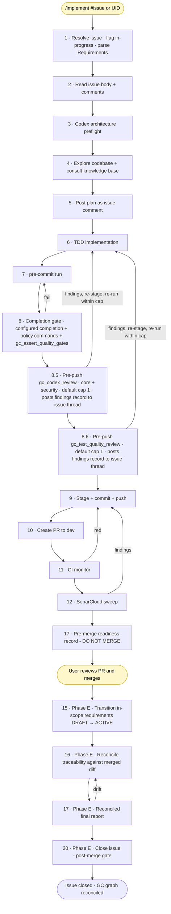

# Development Workflow

This documents the automated development workflow using the `/implement` skill from Claude Code, Codex, or Cursor CLI. The workflow takes a Ground Control requirement from plan through PR-ready with a single skill invocation.

## Prerequisites

### GPG Signing
- GPG key `B47C8B1F62CC2B54` has no passphrase (removed 2026-03-31)
- Commits are signed non-interactively by Claude Code
- Global deny rules and blocking hooks were removed to enable this

### OpenTelemetry Observability
- OTEL collector runs as a Docker container at `~/.claude/telemetry/`
- Config: `~/.claude/telemetry/otel-collector-config.yaml`
- Compose: `~/.claude/telemetry/docker-compose.yml`
- Output: `~/.claude/telemetry/data/claude-code.jsonl`
- Rotation: 100 MB max, 90-day retention, 10 backups
- Start: `cd ~/.claude/telemetry && docker compose up -d`
- Analyze: `~/.claude/telemetry/claude-metrics`

Env vars in `~/.claude/settings.json`:
```
OTEL_LOGS_EXPORTER=otlp
OTEL_LOG_TOOL_DETAILS=1
OTEL_EXPORTER_OTLP_ENDPOINT=http://localhost:4317
```

### Codex CLI
- OpenAI Codex CLI (`codex-cli`) installed at `~/.nvm/versions/node/v25.8.1/bin/codex`
- Used for architecture preflight and cross-model code review via Ground Control MCP workflow tools

## Workflow: `/implement <issue-number | requirement-uid>`

Every `/implement` run is driven by a GitHub issue. The issue is the durable artifact that records why the change is being made, which requirements are in scope (if any), and what acceptance looks like. You invoke the skill in either of two ways:

- **`/implement 123`** or **`/implement #123`**: implement GitHub issue #123 in the current repo. The issue body may declare in-scope requirements under a `## Requirements` section (a bulleted list of UIDs). The skill parses that section and carries the list through clause verification, traceability reconciliation, and status transitions. If the section is absent or empty, the run is treated as a bug fix / refactor / maintenance change with no formal requirements; traceability is still reconciled against the diff, but no requirement is transitioned to `ACTIVE`.
- **`/implement GC-X042`**: implement a requirement by UID. The skill finds the open GitHub issue linked to that requirement via traceability (`artifact_type: GITHUB_ISSUE`); if no such issue exists, it creates one via `gc_create_github_issue` and adds the UID to its `## Requirements` section. From that point forward the run is identical to the first form: the issue becomes the authoritative input.

Grouped implementation (shipping several related requirements in one PR) is expressed by listing all of them under `## Requirements` in a single issue body. One issue → one `/implement` run → one PR → N requirements transitioned to `ACTIVE` in the same commit stream. Do NOT spin up one issue per requirement when they belong together; the grouping is what makes the review boundary coherent.

Repo-local Ground Control project context comes from a `.ground-control.yaml` file at the repo root (with larger rule files under `.gc/`), not from `AGENTS.md` inline YAML or hardcoded assumptions in the skill. The workflow validates this via `gc_get_repo_ground_control_context` before it starts implementation; that call returns the project id, workflow commands, SonarCloud settings, and plan rules in a single response. It should:
- use the repo's configured Ground Control `project` when present
- treat inputs like `OBS-001`, `DSL-101`, `API-412`, or `GC-J001` as already-complete UIDs
- avoid guessing a prefix from the repository name

Recommended `.ground-control.yaml` convention:

```yaml
schema_version: 1
project: aces-sdl
github_repo: owner/repo

workflow:
  test_command: make test
  completion_command: make check
  lint_command: make lint
  format_command: make format
  # Repo-native policy/governance gate. Defaults to `make policy`; set it when
  # your gate is named differently. It is never skipped when absent.
  policy_command: make policy
  # Pre-publish hook boundary. Defaults to `pre-commit run --all-files`; set it
  # for lefthook, husky, or a bespoke script.
  precommit_command: pre-commit run --all-files
  base_branch: dev

sonarcloud:
  project_key: Owner_Project
  organization: owner

rules:
  plan_rules: .gc/plan-rules.md

knowledge:
  dir: docs/knowledge
  schema: docs/knowledge/SCHEMA.md
  inbox: docs/knowledge/inbox

docs:
  adr_dir: architecture/adrs/
  architecture_overview: docs/architecture/ARCHITECTURE.md
  coding_standards: docs/CODING_STANDARDS.md
  workflow_reference: docs/DEVELOPMENT_WORKFLOW.md
  knowledge_base: docs/knowledge/

example_paths:
  source: src/
  test: tests/

requirements:
  uid_examples:
    - GC-X001
    - OBS-042

cross_cutting_concerns:
  description: |
    Logger: <project logging convention>
    Validation: <schema / validation convention>
    Errors: <error envelope / handler>
    Tests: <fixture and test-slice patterns>

routing:
  enabled: false
  default_provider: claude
  stages:
    implementation:
      tier: medium
      provider: claude
      model: claude-sonnet-5

telemetry:
  enabled: false
```

Config contract:

- `schema_version` is required and currently must be `1`.
- `project` is required and must be a lowercase identifier using letters, numbers, and hyphens.
- Unknown top-level keys are rejected. Current top-level keys are `schema_version`, `project`, `github_repo`, `workflow`, `sonarcloud`, `rules`, `knowledge`, `docs`, `example_paths`, `requirements`, `cross_cutting_concerns`, `routing`, `telemetry`, `architecture`, and `short_code`. A legacy `grc` key from a pre-retirement config is still tolerated (not a schema-validation failure) so an existing consumer repo's config does not break, but it is ignored input, not a supported configuration surface (ADR-089); do not add new `grc.*` config.
- `workflow.*` values are optional non-empty strings. `workflow.base_branch` must be a safe Git ref name using `[A-Za-z0-9._/-]`.
- `sonarcloud` is optional, but when present it must include non-empty `project_key` and `organization`.
- `rules.plan_rules` is optional and points to the repo-relative plan-rules file whose content is inlined into `gc_get_repo_ground_control_context`.
- `knowledge.dir` is required when `knowledge` is present. `knowledge.schema` and `knowledge.inbox` are optional overrides; by default they resolve under `knowledge.dir`.
- `docs.*` and `example_paths.*` are optional repo-relative paths. Docs paths are containment-checked so a config file cannot point an agent outside the repository.
- `requirements.uid_examples` is optional and must be a list of non-empty strings.
- **Server-side UID allocation (ADR-060, issue #532):** when creating a requirement via `gc_requirement create`, supply `uid_prefix` (for example, `GC-T`) instead of an explicit `uid` to let the server assign the next available `{PREFIX}-{N}` atomically. The server reads the current high-water mark from the database (archived rows included), increments it, and returns the allocated UID. Use `uid` only when you need a specific, pre-determined identifier.
- **Requirement UID validation is a bounded-scalar check, not a grammar (issue #1425).** A stored UID is project-local identity: the backend accepts any identifier within its 50-character bound (`Requirement.uid` is `@Column(length = 50)`) and resolves it case-insensitively, and the allocator emits `{PREFIX}-{N}` with no zero-padding, so `APP-2` is as canonical as `GC-O007`. MCP tools that accept a UID therefore validate a single, non-empty, transport-safe identifier within that bound and leave existence to the project-scoped lookup; an unknown UID comes back through the normal error envelope rather than being refused as malformed input. Do not derive UID validation from `RequirementUidAllocator`'s prefix grammar: prefix allocation and identity lookup are different concepts. Three concepts stay separate: structured input validation (bounded scalar), identity resolution (REST lookup), and rendered-body recognition (a presentation-policy check over Markdown). Every surface accepts a subset of that one corpus, and the surfaces that gate publishing accept exactly it: `gc_render_pr_body` and the `pr-requirement-uid` gate in `tools/policy/checks.py` both take the full corpus, so a UID that reconciles and reports can always be rendered. The PR-body gate reaches that parity by parsing the `## Requirement UIDs` section structurally (one UID per bullet, or the explicit `- (none ...)` marker for requirement-free runs) rather than scanning the whole body for a UID-shaped token. Scoping to the section is also what stops an `ADR-NNN` reference elsewhere from satisfying a requirement gate. Only free-form prose scanning keeps a narrower shape, because `notes` and `prose` are themselves valid identifiers and no lookup is available to settle it there; that path never gates rendering or reporting.
- `cross_cutting_concerns.description` is optional free text shown to agents during planning.
- `routing.enabled` defaults to `false`. When enabled, omitted `/implement` stages use built-in defaults; `routing.stages.<stage>` overrides a specific stage/purpose route.
- Routing stages use lowercase stage keys matching `[a-z][a-z0-9_-]*`. Route fields are `tier`, `provider`, and `model`.
- Routing `tier` is one of `low`, `medium`, or `high`; `provider` currently supports `claude`. Routing is advisory metadata and does not select an executor or force delegation.
- Claude model values in executable routing config must be canonical CLI ids such as `claude-haiku-4-5`, `claude-sonnet-5`, or `claude-opus-4-8`; display aliases like `sonnet-4.6` are rejected.
- `telemetry.enabled` defaults to `false`. `gc_log_step_telemetry` refuses to write telemetry unless this is explicitly true.

`AGENTS.md` should still carry a brief `Ground Control Context` section that points agents at `.ground-control.yaml` and `.gc/`, so repo newcomers know where the workflow config lives.

### User Touchpoint

Per ADR-029, the workflow has **one** synchronous human touchpoint: PR review and merge to `dev`. Plans are posted to the GitHub issue thread as comments and the agent proceeds without waiting; review findings and decisions on findings are also recorded on the issue thread. Everything before merge is automated.

### High-level flow



**How it reads:**

- **Yellow** nodes are user touchpoints. Per ADR-029, the workflow has **one** synchronous human touchpoint: PR merge (the `End` node). Plans are posted to the GitHub issue thread (S5) and the agent proceeds without waiting; review findings and decisions on findings are also recorded on the issue thread.
- **Post-merge reconciliation (issue #963).** Phase D now ends at a **pre-merge readiness record** (Step 17 with `gc_assert_completion phase="pre_merge"`, carrying a `ready_for_review` marker) and STOPS for the user to merge. The requirement `DRAFT→ACTIVE` transition (Step 15), traceability reconciliation against the merged diff (Step 16), the reconciled final report (Step 17 `phase="post_merge"`), and the issue close (Step 20) all run in **Phase E, after the merge** - re-entered by re-running `/implement <issue>`, which Step 1 detects via the `ready_for_review` marker + a merged PR + no `gc:final-report` marker yet, and short-circuits to Step 15. Detection does not require the issue to be open: the PR body's `Closes #<n>` keyword may auto-close it at merge before Phase E runs, and the transition/reconcile/report operate regardless of issue state (Step 20's close then no-ops). `gc_assert_completion phase="post_merge"` is merge-gated (refuses with `completion_pr_not_merged` unless the PR is merged), so Ground Control state never runs ahead of shipped code - a reviewed-but-abandoned PR leaves the requirement DRAFT and unlinked. This extends the #1058 post-merge close-ordering guarantee to the rest of the GC state.
- **Entry is always by issue.** Step 1 resolves the input to a GitHub issue (either directly or via a UID → issue shim) and parses the `## Requirements` section from the issue body into `in_scope_requirements[]`. The list may be empty (bug fix / refactor) or contain one or many UIDs (grouped implementation). Everything downstream treats the issue as the authoritative context and the list as the set of requirements to be transitioned to `ACTIVE` on completion. Step 1 also creates the feature branch with a **bounded short-slug name**: `gh issue develop` is invoked with `--name <issue-number>-<short-slug>` (≤ 50 chars, ASCII-only); skipping `--name` lets `gh` slugify the full issue title and produces unusable 100+ character branch names that break terminal display, copy-paste, CI breadcrumbs, and downstream shell quoting. The skill then **validates the actual checked-out branch against the same rule**: `gh` reuses existing branches, so a previous pickup that ran before this rule existed (or didn't follow it) would otherwise hand the agent a non-compliant branch that flows through pickup comment, push, CI, and PR. The post-check fetches the configured base and compares against `origin/<base>` (local base can be stale); renames the branch in place when it has no commits relative to the remote base and no PR exists, or applies the in-progress signal first (so a paused picked-up issue stays visibly flagged) then stops and escalates to the user when a published PR is on the line. The post-check is the dispositive enforcement (the `--name` flag only governs first-time pickups). Slug derivation rule, validation predicate, and worked examples live in `skills/implement/SKILL.md` Step 1 sub-step 11. Step 1 then flags the resolved issue **in-progress**: an `in-progress` label (created on demand if the repo lacks it) plus a pickup comment on the thread recording the driver, the checked-out branch, and a timestamp; a maintainer scanning `/issues`, or another agent, sees at a glance that work is underway. The in-progress label removal is optional best-effort after Step 17 completion; it is no longer a mandatory gate (#1103). The GitHub issue itself stays open until the user merges the PR, at which point GitHub closes it automatically via the `Closes #<issue-number>` keyword rendered into the PR body by `gc_render_pr_body` (Step 9). A run that escalates to the user without completing intentionally leaves both the label and the issue open, because the issue *was* picked up but the work is paused, not finished.
- **Steps 1–4** gather context and run the codex architecture preflight before any code is written. Step 4 also consults the repo knowledge base via the index if one is present.
- **Step 6** is TDD (red → green → refactor per clause). Steps 7–8 are the local quality gate. A narrow documentation-only carve-out is documented in `skills/implement/SKILL.md` Step 4.4 for diffs that contain no executable behavior and whose claims are protected by an existing structural gate (policy check, schema validator, lint rule, verifier script). The carve-out must be declared in the plan and re-stated as an issue comment naming the gate; substring/snapshot tests written only to satisfy TDD wording are explicitly disallowed. The completion gate re-validates the carve-out with a two-check sweep over the union of committed, staged, unstaged, and untracked paths (Step 6 runs before stage-and-commit, so working-tree state is part of the diff): every path must be in the documentation set AND every diff hunk's content must be free of executable behavior; a path check alone isn't enough, because a doc file can still carry executable behavior.
- **The completion gate (step 8) evaluates the project's quality gates** server-side via `gc_assert_quality_gates` (issue #1101) and blocks the run on any failing gate. The failure envelope lists each project-level failing gate as `{name, metric_type, threshold, actual}` so the metric to fix is obvious from the error alone. The enforced metric types are `COVERAGE` (over IMPLEMENTS / TESTS / DOCUMENTS link coverage), `ORPHAN_COUNT`, and `COMPLETENESS`. The tool also receives `in_scope_requirements[]`; when the active `DOCUMENTS` coverage gate exists, it checks every in-scope requirement for a `DOCUMENTS` traceability link regardless of DRAFT or ACTIVE status and returns `in_scope_documentation_coverage_failed` with `missing_documents[]` on gaps. The gates themselves are declared in `tools/ground_control/policy.json` and synced to the live instance with `make sync-ground-control-policy`; the same project-level evaluation runs in CI via `make policy-live`. The backend (`QualityGateService.evaluate`) owns project gate math; the tool shapes the pass/fail envelope and adds the PR-scoped in-scope check.
- **Step 8.5 (= SKILL Step 6.5)** is the pre-push Codex review pass per issue #804: `gc_codex_review` with `uncommitted=true` runs locally against the staged + unstaged diff and posts a verbatim findings record to the resolved issue thread for each cycle (durable per ADR-029). **Default cap is 1 cycle** (issue #906); configurable per repo via `workflow.codex_review.pre_push_cap` in `.ground-control.yaml`, bounds `[1, 10]`. The cap is enforced **per issue** (the cycle counter is anchored to the GitHub issue thread; the current branch is recorded in the marker for audit context but is NOT part of the cap key, so a branch rename on the same issue cannot reset the counter; see ADR-029). After a cycle's findings are surfaced, the agent **dispatches on the returned `next_action`**: re-stage and re-invoke ONLY on `fix_findings_and_reinvoke`; on `fix_findings_then_summarize_and_escalate` (the last-in-cap action, which fires on cycle 1 under the cap-1 default when findings are present) fix and post the decision record but escalate to the user instead of a blind re-invoke that would only return `codex_review_prepush_cap_reached`. No commit/push between cycles. The post-push codex review (former Step 12 in earlier numbering) was removed by issue #804; merge-commit drift is the responsibility of CI (compile/tests/integration) and SonarCloud (quality).
- **Step 8.6 (= SKILL Step 6.6)** is the pre-push test-quality review, moved pre-push by issue #906 from the former post-PR Step 13. `gc_test_quality_review` runs locally against the same staged + unstaged + untracked diff. **Default cap is 1 cycle**; configurable per repo via `workflow.test_quality_review.pre_push_cap`. Same local-only iteration loop as Step 6.5 (re-stage, do NOT commit between cycles); same `gc_post_decision_record` contract for the durable record. The MCP tool returns a `{findings, cycle, cap, next_action, ...}` envelope; the parent /implement agent reads `next_action` as a directive (`fix_findings_and_reinvoke` / `post_clean_decision_record_and_advance_to_phase_c` / `fix_findings_then_summarize_and_escalate` (last in-cap cycle: fix + escalate, NOT re-invoke) / `post_summary_and_escalate_to_user`), not as prose to summarize back to the user. Per #884 v2 this is an MCP tool, not a Skill; the v1 Skill-tool boundary returned prose findings that the parent's autoregressive "I just got a result, present it" bias kept echoing back to the user instead of fixing in-turn; the MCP boundary closes that bias structurally. See `architecture/notes/test-quality-review-engine.md` for the full mechanism (engine, auth, failure modes).
- **Automated cap disposition (optional, default off; issue #1245).** When `workflow.review_disposition.enabled` is true, the cap boundary at Step 6.5 / 6.6 is dispositioned automatically instead of always stopping for the user. After the last-in-cap findings are fixed, self-verified, and re-staged, the orchestrator calls `gc_review_cap_disposition`, which scores the **post-fix** diff server-side (diff size, changed-surface class, finding shape, and prior auto-overrides) and returns `proceed` (advance), `one_more_cycle` (re-invoke the cycle tool with `override_cap=true` + `auto_grant=true`), or `escalate_to_human` (stop for the user as today). A gray-zone LLM judge ranks only the residual undecided band; it can never override the deterministic ceiling/fast paths. Authority for the one auto-granted over-cap cycle is a durable `gc:review-auto-disposition` marker the tool posts, **not** agent `override_reason` text; the cycle wrappers verify the marker before honoring `auto_grant=true`. A hard `max_auto_overrides` ceiling (default 1) caps the auto path at one extra cycle; beyond it only the human `override_cap` escape proceeds. `mode: shadow` (the enabled default) posts the disposition but still escalates, building agreement data before `mode: authoritative` lets the disposition drive control flow. This repo runs the enabled workflow in `mode: authoritative`, so approved dispositions drive the next step automatically. With the knob off, behavior is byte-for-byte unchanged. Enforced in the MCP layer (ADR-031 / ADR-029 amendments, GC-O007).
- **Deterministic execution bands (#1426).** Successful-path mechanical work is composed by `gc_implement_mechanical` instead of consuming a separate model turn per step: `bootstrap` gathers Steps 1–2 context and pickup state, `verify` runs Step 6, `publish` runs Steps 7–8.5, `monitor` runs Steps 10–11, `readiness` records Step 17 pre-merge, and `finalize` runs Step 17 post-merge plus Step 20. Each action advances only after its existing guardrails pass. It returns `agent_required: true` only for an actionable failure such as a test, hook, merge conflict, CI failure, or Sonar finding; the caller repairs that condition and retries the same action. Publish conflicts return the exact synchronization evidence required to resume the preserved merge. Architecture, implementation, review finding decisions, and post-merge traceability reconciliation remain agent work.
- **Requirement identity for repository gates (#1434).** A repository whose completion, policy, or pre-commit command runs a requirement-governance check normally derives the requirement under test from the branch name. `/implement` can target a requirement whose issue branch carries no UID, so an optional `requested_requirement_uid` on `gc_implement_mechanical` and `gc_synchronize_implement_branch` reaches every repo-authored gate as the `ACES_REQUIREMENT_UID` environment variable: the `verify` completion and policy commands, the `publish` pre-commit command, and both final-tree gates at Step 8.5, including the committed-retry path. The value travels in the child environment rather than the command text, so it never enters argv and offers no interpolation point. A well-formed UID is not authority: every action that can reach a gate resolves the requested UID server-side against the target issue's canonical Requirements section and refuses an unlisted one before any gate runs. Each of these actions is independently callable, so `bootstrap`'s membership check protects only its own entry point; without the shared binding a caller could name a requirement from another issue or project and have the repository's governance gate evaluated, and attested, against it. Omitting the input changes nothing: no variable is injected, and branch-derived governance behaves exactly as before. The environment is the only place the value exists; it is never added to result envelopes, telemetry, synchronization markers, or issue comments.
- **Steps 7–11** stage, commit, push, synchronize the remote integration branch, open the PR, and block on CI + SonarCloud. **Step 8.5 pre-PR synchronization (#1421):** `gc_synchronize_implement_branch` fetches the configured base into `refs/remotes/origin/<base>` with an explicit refspec and either records `already_current` or leaves a real `--no-ff --no-commit` merge for final-tree verification/conflict resolution in the invocation checkout. It verifies the merge graph, pushes normally, and posts a trusted versioned issue-thread attestation containing the fetched-base and resulting-feature SHAs. Step 9 renders the body, then `gc_create_synchronized_implement_pr` re-fetches the base and refuses the GitHub write unless that attestation, the local head, and the remote feature head still match. The canonical workflow has no direct CLI PR-creation fallback. **PR title format (issue #901):** Step 9 validates the title locally and again at the MCP creation boundary. The title uses one conventional-commit type with optional scope and a lowercase-leading subject; per-repo `workflow.pr_title` overrides remain authoritative.
- **Steps 13 / 14 were merged out by issue #906.** Test-quality review moved pre-push to Step 6.6; there is no separate post-PR review step. Final CI re-verify (former Step 14) collapsed into Step 10's existing CI watch on the original push; without a post-push fix loop there is no second CI run to re-verify. **Steps 18 / 19 were consolidated into Step 17 by issue #1103.** The consolidated Step 17 calls `gc_assert_completion`, which sequences the traceability reconciliation assertion and final report post in one deterministic call. The numbering of Steps 15 / 16 / 18 / 19 (transitions, reconciliation, label, final report) is preserved so external references don't track a moving target; Steps 13 / 14 / 18 / 19 are intentional tombstones in SKILL.md, not errors.

#### Test-quality review engine

`gc_test_quality_review` shells out to the host's `claude` CLI:

```
claude --print
       --model claude-sonnet-5
       --output-format json
       --json-schema <findings schema>
       --add-dir <repo>
       --permission-mode bypassPermissions
       --allowedTools "Read Glob Grep"
```

with the prompt on stdin and `ANTHROPIC_API_KEY` **stripped from the subprocess env**. The strip is intentional: when the env var is set, `claude` uses it preferentially over the host's OAuth session; the env-var-anchored account is often empty (set up but never funded) while the OAuth account is what the user actually uses. Stripping forces OAuth - the canonical user-driven auth path that also powers the parent /implement run.

**Operator quickstart:**
1. Run `claude login` on the host once (credentials persist in `~/.claude`).
2. `/implement <issue>` invokes Step 6.6 automatically; no separate action needed.

**Model override:** pass `model` in the MCP call (`claude-haiku-4-5`, `claude-opus-4-8`, etc.). The /implement SKILL uses the default `claude-sonnet-5`.

**Separate billing account:** if the env-var path is preferred, remove the env-var strip in `runSingleClaudeTestQualityReview` (lib.js) and ensure `ANTHROPIC_API_KEY` has credits. The default strip path keeps OAuth as the canonical auth.

The legacy `Skill("review-tests")` path was removed in #884 v2. Existing host installs at `~/.claude/skills/review-tests/` and `~/.codex/prompts/review-tests.md` are orphaned and can be deleted manually; `bin/install-skills.sh` no longer installs them.
- **Step 15 transitions each in-scope requirement to `ACTIVE`.** This MUST happen BEFORE Step 16's traceability reconciliation: the Ground Control API enforces `IMPLEMENTS-only-on-ACTIVE`, so reconciling first against a still-DRAFT requirement silently fails. Forward-looking requirements (the diff documents/references but does not deliver) stay DRAFT and use `DOCUMENTS` links instead in Step 16.
- **Step 16 is traceability reconciliation, not link creation.** It walks every added/modified/renamed/deleted file in the diff, finds existing IMPLEMENTS/TESTS links pointing at each, and updates/deletes/creates links so the Ground Control graph matches reality after the change. Runs with zero in-scope requirements still reconcile, because a bug fix may have touched files linked to other requirements whose links are now stale. Deleting the sole implementation of a requirement is escalated to the user rather than silently removing the link. When the diff *finalizes* a requirement (for example, an ADR clarification or workflow-doc update that ships the requirement) but the structural implementation lives in pre-existing files shipped under a sibling requirement, Step 16 backfills IMPLEMENTS links onto those pre-existing artifacts of record. The backfill is bounded by the requirement's concrete subject matter - not a whole-repo scan.
- **Step 17** runs the consolidated Phase D completion via `gc_assert_completion`, which sequences the traceability reconciliation assertion and final report post in one deterministic call. These steps run LAST, after every reviewer has signed off, so Ground Control never runs ahead of code that hasn't passed review. Zero in-scope requirements → Step 15 is a no-op; Step 16 still reconciles; Step 17 still asserts and posts the final report.
- **Every downstream failure loops back to step 9** (stage + commit + push), which is the single re-entry point for fix commits. The completion gate (step 8), the pre-push codex review (step 8.5), and the GC verify (step 17) are the loops that target earlier steps, because they correspond to local-only / pre-PR / GC-only state respectively.

Claude does NOT merge. The user reviews the PR and merges.

## Per-step routing, tool surfaces, and telemetry (ADR-036)

Per ADR-036 the `/implement` skill carries three cost-side optimizations layered on top of the GC-O007 gate model (which is unchanged on the contract - one human touchpoint at PR merge, ADR-029's configurable pre-push Codex cap [default 1 cycle per #906; per-repo override via `workflow.codex_review.pre_push_cap`], zero deferral, four-phase structure).

| Optimization | What it changes | Opt-in knob |
|--------------|-----------------|-------------|
| Per-step routing | Each step carries a provider-neutral tier (`low`, `medium`, `high`); `gc_resolve_workflow_route` resolves advisory provider/model/tier metadata from `.ground-control.yaml`. The primary invocation session remains the normal executor for all drivers; Ground Control does not manufacture subagents for routine work. | `.ground-control.yaml` → `routing.enabled` (default `false`) plus optional `routing.stages.<stage>` overrides |
| Durable-record MCP tools | `gc_post_decision_record` (Step 6.5 cycle decisions), `gc_post_final_report` (Step 17 final report, invoked via `gc_assert_completion`), `gc_render_pr_body` (Step 9 PR body) replace agent free-prose with deterministic structured-input renderers. All three filter sensitive content, post under a structured marker family, and reject `decision: "defer"` server-side. `gc_post_final_report` also requires `/implement` callers to pass `plain_english_outcome`, which renders an Outcome section before the structured evidence. | Always available; SKILL calls them unconditionally once the tools are present |
| Traceability + post-merge close gates (#1058/#1156/#1103) | `gc_assert_completion` (Step 17) sequences `gc_assert_traceability_reconciled` (posts `traceability_reconciled` marker) and `gc_post_final_report` in one deterministic call. The `traceability_reconciled` marker is posted by the traceability assertion within `gc_assert_completion`; `gc_post_final_report` refuses to publish without it, and `gc_assert_completion` uses `internalVerifiedPhases` to avoid a GitHub read-after-write race on the marker it just posted. On traceability lookups, `project` is optional: an explicit value overrides, otherwise the MCP layer infers from `repo_path`'s `.ground-control.yaml` via `getRepoGroundControlContext`, and when neither yields a project the backend remains authoritative (`project_required` with `project_count` on multi-project deployments). Structured `project_required` detail is preserved through the composite completion envelope (#1462). `gc_close_issue_after_merge` (Step 20 / Phase E) verifies the linked PR's `merged_at` non-null AND state `MERGED` before closing the issue, idempotent on already-closed issues, and performs only linked-PR resolution, merge-state verification, and closure - no next-issue recommendation (ADR-089). The /quickfix lane is requirement-free and exempt from the traceability and outcome gate. | Always on for `/implement`; `lane: "quickfix"` opts out of the traceability and outcome prerequisites |
| Per-step telemetry | `gc_log_step_telemetry` writes one JSONL line per routed step to `.gc/telemetry/<issue>-<sanitized-branch>.jsonl` (gitignored, repo-relative, containment-validated). Operational measurement only - never workflow state. The tool refuses with `telemetry_disabled` when the opt-in knob is off; the agent prose is not the gate. Summarizer reports wall time + token counts (when present) per step and per model; dollar-cost translation is future work. Target: `make implement-cost-summary`. | `.ground-control.yaml` → `telemetry.enabled` (default `false`) |

Each new tool is deterministic and structured-input/output, with no LLM call in the tool itself.

### Live workflow-run recording (issue #1435, ADR-061)

`gc_implement_mechanical` records the run into the ADR-061 reporting model as it happens, so an
in-flight run is queryable rather than reconstructable only after it ends:

- the run is opened at `bootstrap` (`final_state=RUNNING`, `started_at`, `provenance=LIVE_EMISSION`),
  keyed on the existing `(project, repo, issue_number, branch)` upsert key;
- each mechanical band records one station attempt (`issue_branch_resolution`, `completion_gate`,
  `git_publish`, `ready_for_review`, `post_merge`, plus `ci` and `sonarcloud` for the two gates
  `monitor` runs) as a `STARTED` event followed by `COMPLETED` or `FAILED` with the measured
  duration and the stable error code;
- the run reaches `READY_FOR_REVIEW` (still open, no end time) after readiness, `MERGED` after the
  post-merge phase, `CLOSED`/`CLOSED_WITHOUT_MERGE` when the linked PR is observed closed unmerged,
  and `SUPERSEDED` when a later attempt opens on a different branch for the same issue;
- `pr_number` is attached from the `monitor` boundary onward, once the tool layer authoritatively
  holds it. It refines the run rather than identifying it, and is omitted while unknown so an
  earlier boundary can never clear a PR a later one recorded.

Three properties are load-bearing. Recording is **fail-open and off the control path**: each
transition is timestamped the moment it happens and its write is queued, so the workflow never waits
on the backend, neither to start a phase nor to return its result. Writes are individually bounded
by a timeout, and the first failure disables emission for the rest of the run rather than retrying
at every boundary. A phase can never fail, change, or stall because telemetry did.
A failed **phase attempt is not a failed run**; the agent repairs and retries while the run stays
open. And this is **not** governed by `telemetry.enabled`, which covers the ADR-036 local JSONL
economics, a different measurement axis.

`gc_workflow_run_ingest` remains the backfill and reconciliation path. The two converge on
`workflow_phase_event.source_id` instead of double-counting an attempt. `RUNNING` means that no
terminal observation has been recorded, not that a process is alive: a killed agent cannot write its
own ending, and strict liveness needs the lease/heartbeat design the ADR-061 amendment defers.

## Review Pipeline

One mandatory pre-implementation architecture pass, then a single pre-push codex review pass (Step 6.5), then test-quality review before the user sees the PR. The post-push codex review (former Step 12) was removed by issue #804 - the canonical codex pass is the pre-push one, which catches everything codex would normally flag while collapsing the asymmetric "post-push finding → guaranteed CI/SonarCloud roundtrip" cost. Merge-commit drift relative to base is the responsibility of CI (compile/tests/integration) and SonarCloud (quality), not a separate codex pass.

| Stage | What it catches | How it runs |
|-------|-----------------|-------------|
| Codex architecture preflight | Cross-cutting concerns, reuse opportunities, abstraction/concept confusion, need for ADR/design guidance before coding | `gc_codex_architecture_preflight` |
| SonarCloud | Coverage, code smells, duplication, security hotspots, open issues on the PR | CI `sonar` job waits for the quality gate, then `tools/sonar/assert_no_new_issues.py` fails on any open issue in the new-code leak period |
| Trivy (blocking) | Container image vulnerabilities, Dockerfile/IaC misconfigurations, in-image secrets | CI job; SARIF artifact `trivy-sarif` on the workflow run page. Reporting scans cover every severity and stay non-blocking; a final gate step **fails the job** on fixable CRITICAL/HIGH vulnerabilities and secrets. Fix by upgrading the dependency, never by a `.trivyignore` suppression |
| OSV-scanner (advisory) | CVEs in Java/Gradle dependencies (read from `backend/gradle.lockfile`) | CI job; SARIF artifact `osv-scanner-sarif` on the workflow run page; non-blocking |
| Codex review (pre-push, Step 6.5) | Fitness for purpose, architectural soundness, maintainability, extensibility, security, established patterns, consistency with the larger codebase. Codex returns structured findings; the MCP server posts a verbatim findings record to the resolved issue thread from the host side; the coding agent dispatches on the returned `next_action` (re-invoke only on `fix_findings_and_reinvoke`; on `fix_findings_then_summarize_and_escalate` fix + escalate without re-invoke). There is no PR yet at Step 6.5, so no inline PR comments are written by the SKILL - inline anchored comments only happen if a direct caller invokes `gc_codex_review` post-push (with a `pr_number`), which the SKILL no longer drives (issue #804). | `gc_codex_review` (`uncommitted=true`); MCP posts the issue-thread findings record |
| `gc_test_quality_review` (Step 6.6) | Assertion-free tests, mock-only assertions, integration-as-unit, tests that can't detect regressions | `gc_test_quality_review` MCP tool (shells out to `claude --print --model claude-sonnet-5` by default; full mechanism in `architecture/notes/test-quality-review-engine.md`) |

**Diff transport and review coverage (issue #1414).** `gc_codex_review` owns diff retrieval end to end. When the complete diff exceeds `GC_CODEX_REVIEW_MAX_DIFF_BYTES` (default 256 KiB; `0` disables the cap), the MCP server splits it into bounded inline slices - on `diff --git` file boundaries, falling back to `@@` hunk boundaries when a single file exceeds the budget - and runs **both** reviewers over **every** slice as one logical review cycle. Slices are not cycles: the per-issue counter, marker family, and cap are unchanged regardless of slice count. The manifest is still supplied, as whole-change context only. Before this, an over-cap diff was replaced by that manifest plus an instruction to fetch per-file diffs through the reviewer's own shell tool; nothing verified the fetch, and a `ship` verdict caveated on the manifest alone was recorded as a clean cycle. The direct result, the compact cycle envelope, and the durable findings record now all carry `diff_mode` (`inline` | `manifest`) and a bounded `review_coverage` (`strategy`, `chunks_total`, `chunks_completed`, `files_total`, `files_covered`, `complete`). Coverage is validated before the first GitHub write: an incomplete slice set returns `ok: false` / `status: "post_failed"` / `error: "review_coverage_incomplete"` with no findings record, decision record, or cycle marker written and no cycle consumed. `gc_review_cap_disposition` re-derives `diff_mode` server-side from the post-fix tree and scores a sliced or unknown-coverage review as slightly riskier than a fully inlined one. An `uncommitted=true` review covers staged and unstaged changes; the prompt no longer claims untracked coverage it does not have (see the consent-boundary note below).

**Async execution (issue #937).** The codex review, codex architecture preflight, and test-quality review tools each spawn a child process (`codex exec` / `claude --print`) that legitimately runs for several minutes. Run synchronously, a single MCP tool-call blocked past the MCP client's per-call timeout; the client abandoned the call and the orphaned child left the workflow with no result handle (issue #893). All five tools (`gc_codex_architecture_preflight`, `gc_codex_review`, `gc_codex_review_cycle`, `gc_test_quality_review`, `gc_test_quality_review_cycle`) now take an opt-in `async` flag (default `false`; synchronous behavior unchanged for direct callers). With `async: true` the tool starts a background job and returns `{ok, status: "running", job_id}` immediately; the new `gc_codex_job` tool polls for the result envelope (`status: "done"` carries the full review result under `result`) or cancels a stuck job (cancel aborts an `AbortController` whose signal kills the child, so nothing is orphaned). The `/implement` step files (2.5 / 6.5 / 6.6) drive the start-then-poll loop. Client-side, `.claude/settings.json` sets `MCP_TOOL_TIMEOUT` / `MCP_TIMEOUT` so long-running MCP tools (including `gc_watch_ci_run` and `gc_watch_sonar_analysis`) have headroom. Full design in ADR-036 (amendments).

All preflight/review stages operate under the same rule: **fix everything, defer nothing.** Review-loop cap (issue #906): **default 1 cycle per reviewer** for codex (Step 6.5) and test-quality (Step 6.6); per-repo override via `.ground-control.yaml::workflow.codex_review.pre_push_cap` and `workflow.test_quality_review.pre_push_cap` (bounds `[1, 10]`). Per-finding `gc_codex_verify_finding` cap stays at 2. If a cycle past the configured cap is needed, `override_cap=true` + `override_reason=<authorization quote>` is required per cycle; otherwise the skill escalates to the user with the full finding history. When `workflow.review_disposition.enabled` is true (default off), `gc_review_cap_disposition` can automate that over-cap decision at the boundary, bounded by a `max_auto_overrides` ceiling (default 1) and marker-gated authority, instead of always escalating; see the "Automated cap disposition" bullet above.

"Defer nothing" is mechanically enforced (issue #830, ADR-029 § "`defer` is not a valid disposition"): the `.claude/hooks/block-defer-language.py` PreToolUse hook blocks `gh issue/pr {create,edit,comment,close}` calls carrying deferral-disposition language ("deferred to a follow-up PR," "addressed in a subsequent PR," "TBD later" in a closing comment, …), and `bin/policy` flags the same language in the PR body at completion gate. Filing a tracking issue does not convert a deferral into a valid disposition; the only valid ones are `fix`, `wontfix` (with explicit user authorization), or `not-applicable` (with rationale). Codex review additionally classifies each finding `one-off` or `class`; a `class` finding must be fixed at the **category** level (a structural gate / shared helper / parameterization; one point of repair applied to every instance), not whack-a-mole'd to the reviewer-named site.

## Guardrails

### Merge guardrails (`git-merge-guard.py` PreToolUse hook)

Agent merges are gated by the `.claude/hooks/git-merge-guard.py` PreToolUse hook (see **Git Merge Guard** below), registered on the `Bash` matcher in both `.claude/settings.json` (this repo) and `~/.claude/settings.json` (host). There is **no** `Bash(git merge *)` / `Bash(gh pr merge*)` permission deny in `~/.claude/settings.json`; the hook is the sole decision point, so there is no settings-permission migration to perform.

- `gh pr merge` - blocked; the user (or the `gc_integration_manager` MCP carve-out) owns all pull-request merges
- `git merge` - conditionally gated: the base-to-feature maintenance merge (`origin/dev` into a non-protected feature branch) is allowed; protected-branch destinations and all other sources/shapes are blocked
- `git reset --hard` and plain `git push --force` / `-f` - blocked

**Activation.** A change to the hook takes effect in this repo's sessions immediately (the project registration points at `.claude/hooks/`), but is not active for other repos/sessions on the host until `scripts/bootstrap-claude-workflow.sh` re-copies it to `~/.claude/hooks/` (see **Workflow Hooks** below). Run that resync after merging a hook change.

### Attribution (`~/.claude/settings.json`)
```json
"attribution": { "commit": "", "pr": "" }
```
No Co-Authored-By, no "Generated with Claude Code," no AI attribution anywhere.

### Workflow Hooks (source of truth: `.claude/hooks/`)

The three user-level workflow hooks listed below are **checked into this repo** under `.claude/hooks/` and installed as **real file copies** at `~/.claude/hooks/<name>` by `scripts/bootstrap-claude-workflow.sh` (see **Tooling** below). Unlike skills (which are symlinked so edits in the repo take effect on the next session), hooks are copied because the harness execs them on every Bash tool call in every Claude Code session on the host. If the runtime path were a symlink into this repo's working tree, any `git checkout` in this repo would silently break hooks for every concurrent Claude window on the machine. Real copies decouple runtime from worktree state.

After editing a hook file under `.claude/hooks/` in the repo, re-run `scripts/bootstrap-claude-workflow.sh` (no arguments, idempotent) to copy the new version into `~/.claude/hooks/`. The `~/.claude/settings.json` hook registrations point at the stable `~/.claude/hooks/<name>` path and work regardless of what this repo is checked out to.

**Drift recovery.** The user-level copy can drift from the repo over time (a different repo's older bootstrap ran last, the host got reset and re-bootstrapped from a stale checkout, an agent edited the user-level file directly). To detect drift, run `scripts/bootstrap-claude-workflow.sh --dry-run`; the script reports any allowlisted hook whose user-level copy differs from the repo. To repair, run `scripts/bootstrap-claude-workflow.sh --force`; that path explicitly overwrites the user-level copy with the repo version (the script otherwise refuses to clobber, since drifted user-level content may be intentional). The repo is the source of truth, so resyncing in this direction is safe by construction. The hook contract is pinned by `tools/tests/test_git_merge_guard.py`, run by `make test` and pre-commit; if the repo hook ever regresses below the test contract the test suite catches it before the resync.

One user-level hook is deliberately NOT in the repo: `~/.claude/hooks/block-break-system-packages.sh`. It's a generic pip/apt safety gate unrelated to the Ground-Control workflow, so it stays host-local and `bootstrap-claude-workflow.sh` leaves it alone.

#### Stop Hook - `verify-implementation.sh`
Blocks Claude from completing, but **only when `/implement` was invoked in the current session**. Scoped by process ID (`$PPID`) so concurrent Claude windows on the same branch don't interfere.

Universal checks (all repos):
- The former changelog-fragment check was retired by issue #1399 (GC-P027): Release Please now owns `CHANGELOG.md`, generating it from Conventional Commit history on `main`, so there is no per-PR `changelog.d/` fragment left to enforce. What replaced it runs in CI, not this host-local hook: product-version-mirror consistency (`tools/policy/checks.py::run_version_mirror_consistency_check`, code `version-mirror-drift`) and the Conventional Commit PR-title gate (`.github/workflows/pr-title.yml`). See § Release model below.

Project-specific checks (`.claude/hooks/verify-extra.sh`, sourced if present):
- shared repo-native policy script (`bin/policy`) over the changed-file set

The hook no longer enforces `/review` and `/security-review` - those were removed from the `/implement` skill in favor of `gc_codex_review` + `gc_test_quality_review`. The `/implement` skill itself is the enforcement point for review coverage; the hook only guards repo policy (`bin/policy`) now that the changelog signal has moved to CI.

#### Skill Call Logging - `log-skill-call.sh`
PostToolUse hook on `Skill` - writes JSONL to `/tmp/claude-skill-log/<PID>.jsonl` (per-session, not per-branch). The Stop hook previously read this log to verify `/review` and `/security-review` were actually invoked; it's still wired up for forward compat in case we reintroduce skill-based checks. Stale logs (>24 h) are auto-pruned.

#### Git Merge Guard - `git-merge-guard.py`
PreToolUse hook on `Bash`. The user owns every protected-branch merge and every pull-request merge. Blocked unconditionally: `gh pr merge`, `git reset --hard`, and a plain `git push --force` / `git push -f`. A `git push --force-with-lease` to a *feature* branch is allowed (that's the rebase-feature-branch-onto-base-then-update-the-PR flow), but a force-push of any kind to a ref named `main` or `dev` is blocked.

`git merge` is conditionally allowed (issue #1382): one narrow base-to-feature maintenance merge - incorporating the integration branch (`origin/dev`) into the current non-protected feature branch so an open PR stays current, then completed with real conflict resolution plus an ordinary `git commit` - is permitted. It is allowed only as a single, directly inspectable `git merge` (no shell operators; no shell expansion or substitution - `$`, backtick, `<`, `>`, which stay active even inside a double-quoted `-m` value and would otherwise run arbitrary shell after the hook returns; no `env`/`sudo`/`VAR=` wrapper; no git global options), carrying only the closed base-update option set (`--no-edit`, `--no-ff`, `--ff`, `--ff-only`, `-m`/`--message`), with no `branch.<dest>.mergeOptions` configured, naming exactly one source that resolves to the `refs/remotes/origin/dev` ref, while checked out on a branch that is NOT in the hardcoded protected set (`main`, `dev`). The current branch is read from the full symbolic ref so a colliding tag can't disguise a protected destination, and the protected set is a hardcoded constant rather than an agent-writable ref or working-tree file (both `refs/remotes/origin/*` and the working tree are writable with a single command). Everything else fails closed: protected-branch destinations; non-`origin/dev` sources (local `dev`, tags, SHAs, same-OID aliases, names merely containing `dev`); unsupported merge modes (`--squash`, `-s`/`-X`, `--allow-unrelated-histories`, `--no-verify`, `--continue`/`--abort`/`--quit`); a configured `branch.<dest>.mergeOptions`; chained / wrapped / global-option / expansion shapes; and detached HEAD.

The guard is a pre-execution *lexical* policy control, not an OS sandbox. It probes repository state with the PATH-resolved `git` while Bash resolves an unqualified `git merge origin/dev` through shell functions and aliases first, so a `git` function/alias/PATH shim could answer the probes with one implementation and run the merge with another (a probe/execution TOCTOU, issue #1397). That residual is deliberately accepted rather than closed: an agent that can install such a shim already bypasses any lexical hook, and the authorized merge only ever writes the agent's own feature branch, so the required control layer for it is the OS sandbox (host filesystem permissions and process isolation), not a stronger lexical check. See the "Trusted Git Execution Disposition (issue #1397)" section in `architecture/notes/merge-guard-base-to-feature-preflight.md`.

### Repo-Native Policy Layer

- `architecture/policies/adr-policy.json` defines machine-readable ADR guardrails
- `python3 bin/policy` enforces ADR/workflow, controller/MCP/docs, migration, and PR-body policy
- `python3 bin/policy` also pins the #1155 CI strictness baseline:
  selected pre-commit hygiene and secret-scan hooks run in CI, the Sonar job
  waits for the quality gate and fails on new issues, and
  `.github/branch-protection-baseline.json` requires strict status checks for
  `main` and `dev` while retaining admin bypass
- **CI topology invariants** (`tools/tests/test_ci_topology.py`, issue #1461 /
  ADR-091) assert the shape of `.github/workflows/ci.yml`: every required
  context has a job, the branch-protection baseline matches
  `CI_STRICTNESS_REQUIRED_CONTEXTS`, no verification job declares a dependency
  on another, `docker` names every gate before it publishes, the
  `fast-feedback` lane exists and stays out of the required set, and the
  `sonar` job keeps its coverage and quality-gate inputs. A required context
  with no job behind it blocks every pull request forever, which is the failure
  these tests exist to prevent. See `docs/ci/CI_PIPELINE.md`.
- **Gate outcome measurement** (issue #1355, ADR-090 amendment). Every station attempt now
  records an explicit verdict alongside its lifecycle event, and the findings it observed are
  counted by reviewer/detector, category, severity, and disposition. The verdict is stated by the
  producer and validated against a closed vocabulary, never derived from a tool succeeding, a
  phase completing, or a pull request merging. A backend outage, parser error, or timeout is
  `not_evaluable`, so an infrastructure problem can never enter the rework signal as a defect in
  the change. `bin/policy --json <path>` and `GC_VALE_JSON` make the policy and Vale child gates
  emit structured artifacts at their own boundary; SpotBugs' XML report serves the same purpose.
  The `/implement` layer reads those artifacts rather than re-running a gate or parsing combined
  console output.
- **Measurement catalogue drift** (`run_measurement_catalogue_check` in `tools/policy/`,
  issue #1438 / ADR-090 / GC-O014) keeps the ADR-090 station catalogue authoritative
  rather than descriptive. `contracts/measurement/gc-station-catalogue-v1.json` owns
  `station_id`; ADR-061 phase strings, ADR-036 routing stages, issue-thread `gc:phase`
  values, MCP action names, and SKILL step numbers are declared aliases. The check
  fails on: an id declared twice or as both a station and a lifecycle marker
  (`measurement-catalogue-duplicate-id`, `measurement-catalogue-station-marker-overlap`);
  an alias resolving to two entries (`measurement-catalogue-ambiguous-alias`); a station
  id emitted by `gc-implement-mechanical.js` that the catalogue does not declare
  (`measurement-catalogue-emitter-drift`); or a `routing.stages` key that resolves to no
  station, no marker, and no declared non-station stage
  (`measurement-catalogue-routing-stage-drift`). Adding a station or an alias is a
  catalogue edit; a breaking station-id or vocabulary change is a new schema version
  under ADR-082, never an in-place edit of a published one.
- `make policy` is the common path for Claude, Codex, and CI
- `make sync-ground-control-policy` and `make policy-live` keep Ground Control quality gates and ADR metadata aligned when a live GC instance is available

Commit-time pre-commit activation is a separate per-clone contract from the
presence of `.pre-commit-config.yaml` and the CI pre-commit job. ADR-079 requires
repo setup to verify Git's effective hook dispatch path for the current clone,
adapt to a supported global `core.hooksPath` dispatcher without mutating global
Git config, and fail closed when hooks are present in config but not wired for
commit-time execution. Run `make hooks` (a wrapper for `scripts/install-hooks.sh`)
once per fresh clone: it writes managed `pre-commit`/`pre-push` hooks into the
clone-local hook path the dispatcher delegates to, proves Git actually dispatches
to them, then runs `pre-commit run --all-files`. `.git/hooks/` is not versioned, so
this step does not survive a fresh clone by design; re-run it after cloning.

Commit time carries only the checks nothing else performs: file hygiene, secret
scanning with gitleaks, `bash -n` on operator scripts, Spotless auto-formatting,
and the GC-P021 backup-policy assertion required by ADR-025. Broad verification
runs at three points that each see a tree the commit hook cannot: the
`/implement` completion and policy gates at Step 6, the same two gates on the
post-base-sync tree at Step 8.5, and the CI `policy`, `test`, and `openjml`
jobs. A fourth copy at commit time re-verified a tree the Step 6 gates had just
certified, and it was the weakest copy of the four - skippable with
`--no-verify`, path-filtered so it degraded silently on diffs outside its
`files:` patterns, and leaving no result any gate or workflow record could
attest to. Run `make check` or `make policy` directly to exercise the broad
gates locally on demand.

### Continuous integration

`.github/workflows/ci.yml` runs every verification job in parallel: none of them
consumes another job's artifact, so whole-run wall clock is the duration of the
slowest job. Three dependencies remain, each guarding a side effect rather than
ordering work: `policy-live` behind `policy` because it is the only job holding
a live API token, `docker` behind every verification gate because publishing an
image is irreversible, and `smoke` behind `docker`.

The `fast-feedback` job reports formatting and compilation errors before any
full lane finishes. It is advisory and stays out of the required-context set, so
the complete suite remains the single merge authority.

`docs/ci/CI_PIPELINE.md` is the job-by-job reference, including which contexts
are required, local reproduction commands, and test lane ownership. ADR-091
carries the rationale. `make ci-timings` reports current wall clock and time to
first failing check.

`gc_watch_ci_run` and `gc_implement_mechanical action=monitor` watch every
workflow run triggered by the branch's newest commit, grouped by head SHA, and
report success only when all of them succeed. Watching a single run reported an
unrelated fast workflow as the CI gate: a push triggers both `ci.yml` and
`pr-title.yml`, and the five-second title lint finishes first, so the gate could
pass while the suite was still running. A failure in the set reports the run
responsible rather than the newest one.

### Contract Surface and MCP Write-Contract Gates (ADR-034, ADR-082)

`make contracts` regenerates the committed contract surface: Springdoc OpenAPI
into `contracts/openapi/openapi.json` and generated TypeScript API types under
`contracts/gen/typescript/`. `frontend/src/types/api.ts` is a compatibility
re-export only; hand-mirrored DTOs and enum constants belong in the generator
inventory, not in frontend source. `make contracts-check` reruns generation and
fails on `git diff` across `contracts/` and that frontend shim.

API-visible enums, including `GraphEntityType`, are registered in the existing
ADR-034 inventory. Contract generation emits both the TypeScript union and its
iterable constant (for example, `GRAPH_ENTITY_TYPES`); frontend colors, filters,
and coverage tests consume that constant instead of maintaining a second list.

`make mcp-openapi-contract` (CI job `mcp-contract`) extends the same flow for
MCP write-tool parity. It is **separate from `make policy`** because OpenAPI is
generated from the current backend build, which requires booting the full Spring
context (Testcontainers Postgres + AGE), while the Python-only `policy` job
cannot do that.

The context-graph ontology is a separate, static contract family under
`contracts/ontology/` (ADR-084). `make policy` discovers `GraphEntityType`,
graph link/relation enums, `ProvenanceEdgeRelation`, and every
`GraphProjectionContributor` directly from Java source, then compares the
result with `gc-artifact-bindings-v1.json` in both directions. A source value
without a binding, a binding whose source vanished, an unknown contributor
edge expression, or a malformed/unresolved ontology reference fails policy.
Shared meanings are declared once in `gc-controlled-vocabularies-v1.json` and
many surface-qualified bindings may point to them; identical spelling alone
does not establish semantic equivalence. Ordinary vocabulary growth adds a
controlled term and binding row. A new source shape requires a checker
extraction strategy, tests, and a registered surface kind. Ontology contracts
are governance data only: they do not rename graph emissions or load at
runtime.

The generated-contract CI flow is:

1. `generateContractOpenApi` (Gradle, `McpOpenApiContractSpecTest`) boots the app
   via Testcontainers, captures `/api/openapi.json`, and writes both
   `backend/build/contract/openapi.json` and
   `contracts/openapi/openapi.json`.
2. `node tools/contracts/generate-contracts.mjs` canonicalizes the committed
   OpenAPI artifact and refreshes the generated TypeScript surface.
3. `git diff --exit-code contracts/ frontend/src/types/api.ts` fails on
   generated-artifact drift.
4. `node tools/contracts/check-breaking-changes.mjs` compares
   `contracts/openapi/openapi.json` against `BASE_REF` and fails removed paths,
   operations, fields, retyped fields, narrowed enums, or tightened required
   sets unless `contracts/CHANGES.md` carries a BREAKING/deprecation record.
5. `GC_OPENAPI_SPEC=contracts/openapi/openapi.json node --test
   mcp/ground-control/openapi-contract.test.js` imports the live MCP
   field arrays (`GOVERNANCE_FIELDS`, `CONTROL_FIELDS`, the per-tool
   `*_BODY_FIELDS`, `LINK_CREATE_BODY_FIELDS`) and asserts, per tool/entity/action
   inventory row, that every MCP field maps to an OpenAPI request-schema property
   and every required property has a mirror, with narrow, rationale-bearing
   exclusions for path/query params, server-populated, transition-only, and
   create-only fields.

Initial coverage is the domain write tools (`gc_risk_governance`, `gc_threat_model`,
`gc_risk_scenario`, `gc_control`, `gc_evidence`, `gc_finding`, `gc_audit`,
`gc_observation`, `gc_asset`) plus the shared `link_create` body. **Adding the
next write tool is one inventory row** in `openapi-contract.test.js` (plus an
exported field array if the adapter lacks one), never a new checker. Anchored by
requirement GC-O013.

## Release model (GC-P027, issue #1399)

Release Please owns product versioning and `CHANGELOG.md`. The Towncrier
`changelog.d/` per-PR fragment convention is retired - feature PRs neither edit
`CHANGELOG.md` nor file a fragment. This replaces the entire "changelog
fragment" step in the completion gate, the Stop hook, and the PR template with
the mechanics below.

- **Conventional Commit PR titles are the input.** `.github/workflows/pr-title.yml`
  (`amannn/action-semantic-pull-request`) enforces a single conventional-commit
  type with optional scope and a lowercase-leading subject on every PR against
  `main` or `dev` - the same vocabulary and pattern the `/implement` skill
  validates locally at Step 9 and again at the synchronized MCP PR-creation
  boundary (`skills/implement/steps/step-09-pr-body.md`).
  A green title check alone only proves the title parses; the signal also has
  to survive the merge.
- **Merge topology preserves the signal.** Feature PRs squash-merge into `dev`
  using the validated PR title as the resulting commit subject. The `dev` to
  `main` promotion merges with a real merge commit (not squash, not rebase) so
  the individual Conventional Commit subjects from `dev` remain discoverable
  on `main`, where Release Please parses history. A promotion that squashed or
  rewrote those subjects would give Release Please nothing to classify.
- **The release PR does the mechanical work.** On every push to `main`,
  `.github/workflows/release-please.yml` (googleapis/release-please-action)
  maintains a `chore(main): release X.Y.Z` PR that regenerates `CHANGELOG.md`
  from the Conventional Commit history and bumps the product-version mirrors
  declared in `release-please-config.json`'s `extra-files` (`backend/build.gradle.kts`,
  `frontend/package.json`, `frontend/package-lock.json`) to match
  `.release-please-manifest.json`. A human merges that PR the same way any
  other PR is merged - releases are cut by merging it, never by hand-tagging
  or hand-editing `CHANGELOG.md`.
- **Version-mirror drift is enforced in CI, not locally.** `tools/policy/checks.py::run_version_mirror_consistency_check`
  (code `version-mirror-drift`) fails `make policy` if a product-version mirror
  disagrees with `.release-please-manifest.json`. Mirrors are only ever
  supposed to move via the release PR; a hand-edited mirror trips this check.
- **`main` to `dev` stays in sync.** `.github/workflows/sync-main-to-dev.yml`
  opens a back-merge PR after the release PR merges (main is ahead of dev by
  exactly the release commit); a human merges that too.
- **Merging the release PR is not a deploy.** Production stays operator-driven
  through `make deploy` (ADR-030 / ADR-063) - see `docs/deployment/DEPLOYMENT.md`
  for the deploy-by-digest path, which is unchanged by this section.

See ADR-063 ("2026-07-15 Amendment: Release Please Ownership") for the full
decision record.

## /integrate: Approved PR Integration Manager

The `/integrate` lane is the workflow path for preparing maintainer-approved pull requests against the latest base branch of a target repository. It is a lane for maintainers and release operators who need to rebase a queue of already-approved PRs to a clean state. By default the lane operates in **prepare-only** mode: it rebases, gates, verifies, and pushes, but it does not merge. Passing `--mode merge` enables the merge carve-out from the ADR-029 amendment (2026-05-26): the lane also executes `gh pr merge` for each PR it marks ready, per the configured `merge_strategy`. The `enqueue` mode remains reserved and refuses at runtime.

### When to use it

Use `/integrate` when you have a set of PRs in a target repository that carry an approval label (default `approved-for-integration`) and you want to rebase each one onto the current base branch, run the repo's completion gate and CI/Sonar checks, and push the result. The lane does not replace human review: PRs must already carry the approval label before the lane touches them. It replaces the manual rebase-and-push step that a maintainer would otherwise do for each PR in turn.

Do not use `/integrate` to batch-merge PRs autonomously. That boundary is explicit: the lane prepares PRs for merge; the human merges.

### Invocation

```
/integrate [--repo <owner/repo>] [--base <branch>] [--label <label>] [--mode prepare|merge] [--dry-run]
```

All flags are optional. When `--repo` is omitted the lane reads `github_repo` from the target repo's `.ground-control.yaml`. `--base` overrides `workflow.base_branch`. `--label` overrides `workflow.integration_manager.approval_label`. `--mode` selects the execution mode (default `prepare`). `--dry-run` discovers and orders the queue without acquiring a lock or modifying any branch.

You can also call the underlying MCP tool directly:

```
gc_integration_manager action=status  repo_path=<path>
gc_integration_manager action=prepare repo_path=<path>
gc_integration_manager action=prepare repo_path=<path> mode=merge
gc_integration_manager action=release repo_path=<path>
```

### Configuration

The lane reads configuration from the `workflow.integration_manager` block in the target repo's `.ground-control.yaml`. All keys are optional; the defaults shown below apply when the block is absent.

```yaml
workflow:
  integration_manager:
    approval_label: approved-for-integration   # label that marks a PR ready
    ordering: pr_number_asc                    # pr_number_asc | pr_number_desc | approved_at_asc
    max_queue_size: 20                         # integer, [1, 100]
    merge_strategy: merge                      # merge | squash | rebase (default: merge)
```

`merge_strategy` controls the `--merge`, `--squash`, or `--rebase` flag passed to `gh pr merge` when the lane runs in `mode=merge`. The key is only consulted in merge mode; it has no effect in prepare-only mode.

The parser (`normalizeIntegrationManagerConfig` in `mcp/ground-control/lib.js`) enforces the same strict-unknown-key rule as the rest of the workflow config. Unrecognized keys are rejected with a validation error, not silently ignored.

### Maintainer approval signal

A PR is eligible for the queue when it carries the configured approval label. No review state or comment is required by default. The label is the sole eligibility signal, so maintainers can approve by label from the GitHub UI, the CLI, or an automation rule without any integration-manager-specific ceremony.

Remove the label to pull a PR from the queue. The lane re-discovers the queue at each run, so a label change between runs takes effect on the next invocation.

### What the lane does to each approved PR

For each PR in queue order:

1. **Acquire lock.** A repo-level lock under `.gc/integration-lock.json` prevents concurrent runs from preparing the same PR twice. If a lock is already held by another run, the lane halts and reports the lock holder.
2. **Create isolated worktree.** Each PR is processed in a temporary worktree so the main working tree is not disturbed.
3. **Rebase onto base branch.** The PR branch is rebased onto the latest `origin/<base>`. Rebase conflicts halt that PR with a `blocked` failure mode; the queue continues to the next PR (see Failure modes below).
4. **Run completion gate.** The repo's configured `workflow.completion_command` (typically `make check`) runs in the worktree. Failure halts the queue.
5. **Watch CI.** After pushing, the lane polls the GitHub Actions run for the PR and waits for a terminal conclusion. CI failure halts the queue.
6. **Watch SonarCloud.** If the repo configures a `sonarcloud` block, the lane waits for the Sonar analysis and inspects quality gate status. A failed quality gate halts the queue.
7. **Force-with-lease push.** When all gates pass, the lane pushes the rebased branch to `origin` with `--force-with-lease`. This updates the PR's head SHA without disturbing any concurrent push to a different branch.
8. **Release lock.** The lock is released after each PR regardless of outcome, so the next PR can be processed.

### Failure modes

Three failure severities apply:

- **`blocked`**: the current PR cannot be prepared (rebase conflict, completion-gate failure, CI failure, Sonar failure). The queue continues to the next PR. The blocked PR is recorded in the run ledger at `<repo>/.gc/integration-runs/<run-id>/halt.json`.
- **`queue_wide_halt`**: a condition prevents any further processing (lock conflict from a concurrent run, invalid configuration, missing base branch). The queue stops. No further PRs are processed in this invocation.
- **`consultation_halt`**: the lane encounters a condition that requires maintainer judgment before proceeding. The queue stops and the lane reports the condition through the invoking interface. The consultation criteria from GC-O011 clause (h) are: the PR diff touches a file that another queued PR also touches (ordering-sensitive overlap); the rebase produces a commit that is structurally different from the original PR's commits in a way the lane cannot resolve deterministically; the CI run produces a failure log that names a file modified by a different PR in the queue; or the quality gate failure names a metric that was passing before the rebase and failing after. In any of these cases the lane must stop and consult the maintainer rather than proceeding with a potentially incorrect ordering or an attribution-ambiguous failure.

### What the lane does NOT do

- No automatic merging in default mode. With `--mode prepare` (default), the lane prepares PRs; a human merges them. Use `--mode merge` to enable the merge carve-out.
- No `enqueue` mode. Enqueue is reserved and refuses at runtime.
- No requirement status transitions. The lane does not touch Ground Control requirement states.
- No traceability reconciliation. The lane does not create or delete IMPLEMENTS/TESTS links against the PRs it prepares.
- No issue-thread comments. Consultation halts and status reports surface through the invoking interface (terminal output and the MCP tool's return envelope), not as comments on any GitHub issue thread.

### Operating tips

Check lock state and queue without modifying anything:

```
gc_integration_manager action=status repo_path=<path>
```

Release a stale lock (for example, from a run that was interrupted before cleanup):

```
gc_integration_manager action=release repo_path=<path>
```

Inspect the run ledger for the most recent halt:

```
cat <repo>/.gc/integration-runs/<run-id>/halt.json
```

Pass `--dry-run` to the `/integrate` skill to see what the queue would contain without acquiring a lock or touching any branch.

## Standalone Skills

Workflow skills live in **two** repo roots, each with its own installer. The two name sets are disjoint, so the two install paths can never resolve the same name to different definitions:

- **`skills/<name>/SKILL.md`** - agent-neutral skills shared by Claude Code, Codex, and Cursor CLI (per ADR-027). `bin/install-skills.sh` installs each into `~/.claude/skills/<name>`, `~/.codex/skills/<name>`, (legacy alias) `~/.codex/prompts/<name>.md`, and (hard-copy) `~/.cursor/skills/<name>`.
- **`.claude/skills/<name>/SKILL.md`** - Claude-Code-only skills. `scripts/bootstrap-claude-workflow.sh` symlinks each into `~/.claude/skills/<name>` (see **Tooling** below).

In both cases this repo is the source of truth: edit the `SKILL.md`, commit, and the change takes effect for the next Claude Code (or Codex) session on a host whose install paths are symlinks into the repo. Re-run the relevant installer after a host reset.

| Skill | Repo root | Purpose |
|-------|-----------|---------|
| `/implement <issue-number \| uid>` | `skills/` | Full end-to-end: plan through PR-ready |
| `/integrate` | `skills/` | Approved-PR integration manager: rebase, gate, verify, and push a queue of approved PRs (prepare-only; see GC-O011) |
| `gc_test_quality_review` | `mcp/ground-control/` | Test-quality review - MCP tool (per #884 v2; replaces the prior `/review-tests` Skill) |
| `/ship` | `.claude/skills/` | Ship an already-committed branch (CI, reviews, fix, report) |
| `/stage` | `.claude/skills/` | Stage files + pre-commit loop |
| `/gh-workflow-monitor` | `.claude/skills/` | Monitor GitHub Actions workflow runs |
| `/repo-setup` | `.claude/skills/` | Set up branch protection + pre-commit + SonarQube wiring on a fresh repo |
| `/wave-issue-coverage` | `.claude/skills/` | Back-fill GitHub issues for a wave's DRAFT requirements |

## Tooling

Repo-local scripts live under `scripts/` (bash) and `bin/` (Python). The ones you're most likely to run by hand:

| Command | Purpose |
|---------|---------|
| `scripts/bootstrap-claude-workflow.sh` | Wire the Claude-Code-only surfaces from `~/.claude/`: the `.claude/skills/<name>/` skills (symlinked - edit takes effect live) and the `WORKFLOW_HOOKS` allowlist under `.claude/hooks/` (**copied** as real files so runtime does not depend on which branch this repo is checked out to). Idempotent; safe to re-run. Pass `--dry-run` to preview, `--force` to clobber non-matching host content. The hook allowlist is explicit, so generic host-local hooks (for example, `block-break-system-packages.sh`) are left alone. Re-run after editing a hook file in the repo to push the new version into `~/.claude/hooks/`. Does **not** touch the `skills/<name>/` agent-neutral skills - that's `bin/install-skills.sh`'s job. |
| `bin/install-skills.sh` | Install the agent-neutral `skills/<name>/` skills into `~/.claude/skills/<name>`, `~/.codex/skills/<name>`, `~/.codex/prompts/<name>.md` (legacy alias), and `~/.cursor/skills/<name>`. Claude/Codex symlink by default; Cursor always hard-copies (`scripts/test-cursor-skill-symlink.sh`). Pass `--copy` to hard-copy every target, `--dry-run` to preview, `--no-codex` / `--no-cursor` to skip those targets, `--force` to overwrite divergent host content. Idempotent; refuses to clobber unmanaged host targets without `--force`. |
| `scripts/pack-sync.sh` | Trigger the `pack-registry-sync` GitHub workflow against this repo. |
| `bin/policy` | Run the repo-native policy guardrails (ADR sync, controller/MCP/docs parity, migration policy, PR-body checks). Invoked by `make policy`, pre-commit, and CI. |
| `bin/adr-guard` | ADR-specific policy checks run standalone. |
| `bin/scaffold-controller`, `bin/scaffold-audited-entity`, `bin/scaffold-l2-state-machine` | Generators that start new code from a compliant shape. Wrapped by `make scaffold-*`. |
| `bin/check-pr-body` | Validate a PR body against the required template. |

### Bootstrapping a fresh host

After cloning this repo onto a new host (or after any `rm -rf ~/.claude/skills/` or `rm -rf ~/.claude/hooks/` reset), run **both** installers:

```
scripts/bootstrap-claude-workflow.sh   # .claude/skills/* skills + the WORKFLOW_HOOKS allowlist under .claude/hooks/
bin/install-skills.sh                  # skills/* (agent-neutral) into ~/.claude/skills, ~/.codex/skills, ~/.codex/prompts, ~/.cursor/skills
```

`scripts/bootstrap-claude-workflow.sh` walks:
- `.claude/skills/*/` - every skill directory gets a matching `~/.claude/skills/<name>` **symlink**. Editing a skill in the repo takes effect immediately in the next session.
- `.claude/hooks/` - only the hooks listed in the script's `WORKFLOW_HOOKS` allowlist (`git-merge-guard.py`, `block-defer-language.py`, `log-skill-call.sh`, `verify-implementation.sh`) are installed as **real file copies** at `~/.claude/hooks/<name>`. Editing a hook in the repo requires re-running this script to push the new version out. Repo-scoped hooks (`protect_files.sh`, `verify-extra.sh`) stay where they are because they're wired via `$CLAUDE_PROJECT_DIR` in `.claude/settings.json`, not via `~/.claude/`.

`bin/install-skills.sh` symlinks each `skills/<name>/` directory into `~/.claude/skills/<name>`, `~/.codex/skills/<name>`, and `~/.codex/prompts/<name>.md`, and **hard-copies** into `~/.cursor/skills/<name>`. Pass `--no-codex` if Codex isn't on the host, or `--no-cursor` if Cursor CLI isn't on the host. Re-run after pulling to refresh Cursor copies; Claude/Codex symlinks update live.

Ground-Control repos also ship a project wrapper at `.cursor/skills/implement/SKILL.md` (a real file, not a symlink) so `/implement` works before the host install step. Run `scripts/test-cursor-skill-symlink.sh` to verify the symlink constraint locally.

If a pre-existing host file or directory has local changes that are NOT in the repo, the script refuses to clobber it and exits non-zero - re-run with `--force` only after you've confirmed the repo copy is the version you want. Already-correct entries are left alone.

### Cursor CLI

Cursor skill discovery for `/implement` works today with the same host bootstrap as Claude Code and Codex: run `bin/install-skills.sh` once on the host. It hard-copies each `skills/<name>/` directory into `~/.cursor/skills/<name>`. **Symlinks do not work** for Cursor skill discovery: Cursor resolves symlink targets and rejects any `SKILL.md` whose real path falls outside the skills root. See `scripts/test-cursor-skill-symlink.sh`.

Ground-Control repos also ship a project wrapper at `.cursor/skills/implement/SKILL.md` (a real file pointing at the canonical `skills/implement/SKILL.md`) so `/implement` is available in-repo without waiting on the host install step.

**Prerequisites** (same orchestrator dependencies as Claude Code / Codex):

- Reachable Ground Control instance; `GROUND_CONTROL_API_TOKEN` in the repo `.env`
- `make ground-control-mcp-install` once on the host
- Repo [`.mcp.json`](.mcp.json) present (Ground Control MCP server)
- `gh` authenticated to the repo
- Codex CLI on `PATH` (architecture preflight + pre-push review MCP tools)
- Claude CLI OAuth session (Step 6.6 `gc_test_quality_review`)
- GPG signing configured for non-interactive commits

**Invoke** from the repo root in **Agent chat** (Cursor 2.4+):

```
/implement 123
```

No space after `/`: type `/implement`, not `/ implement`. The skill uses `disable-model-invocation: true`, so it appears in the `/` menu but is not auto-applied; you must pick it explicitly.

In **Cursor CLI** (no slash menu), pass the workflow as the prompt:

```bash
agent "/implement 123"
```

**CLI permissions** live in [`.cursor/cli.json`](.cursor/cli.json) (project override). For long autonomous runs, pass `--force` if approval prompts would block git/gh/make/MCP calls. The Cursor CLI driver runs every step on the parent session (Codex-style); see the Cursor CLI section in `skills/implement/SKILL.md`.

## Test tooling beyond unit tests (#931, #1293)

The `make test` target runs the unit-test suite; the project also ships three
complementary test-quality signals:

| Signal | Purpose | How to run |
|--------|---------|-----------|
| **Mutation testing (PIT, advisory)** | Runs the backend PIT task to score how well the unit suite detects seeded wrongness. Advisory calibration signal, not a required PR context. | `make test-quality` |
| **Property-based testing (jqwik)** | Already wired on five domain surfaces - cycle detection, finding-status state machine, impact analysis, audit-status state machine, requirement-status transitions. Property tests find edge cases TDD misses by construction. | `make test` (runs alongside the unit suite) |
| **Dependency / SBOM scanning (OSV + Trivy)** | OSV-scanner runs against `backend/gradle.lockfile` in CI. Findings are advisory, **except**: any new CRITICAL CVE fails the job (added in #931). Trivy scans the built image + IaC and **blocks the merge** on fixable CRITICAL/HIGH vulnerabilities or secrets. When it fires, raise the dependency: the Spring Boot BOM's managed version is overridden by the `extra["...version"]` security-patch block at the top of `backend/build.gradle.kts`, and OS packages are patched by the `apk --no-cache upgrade` in `backend/Dockerfile`. Remove an override once the BOM manages a version at or above it. | `.github/workflows/ci.yml` (`trivy`, `osv-scanner` jobs) |

PR CI fetches sanitized issue comments in a token-bearing shell step, then runs
PR-head policy code without `GH_TOKEN` and passes `--pr-comments-json` plus
`--pr-number` so the gate can read the PR-thread marker.

Frontend verification runs in the `frontend` CI job: Biome lint, the Vitest unit
suite, and the production build, reproducible locally with `make frontend-lint`,
`make frontend-test`, and `make frontend-build`.

## Rollback

To roll production back to a prior version: `make rollback VERSION=<x.y.z>` (or `./scripts/rollback.sh <version-or-digest>`). The wrapper patches `GC_IMAGE` in `/opt/gc/.env` and drives the same validated deploy path as `make deploy` (health gate, auto-rollback on failure, deploy-state publish). A digest target auto-sets `GC_ALLOW_IMAGE_PIN=1`. Full runbook: `skills/deploy/SKILL.md` (`/deploy` → §Rollback).

## `/implement` execution principles and problem obligations

`/implement` loads `skills/implement/_development-principles.md` before it
reads workflow configuration, resolves routing, resolves the issue, prepares a
branch, or executes a workflow step. The run pins those principles in an
immutable execution contract used throughout the primary invocation session.

Local verification is risk-proportionate and agent-neutral. Related edits are
batched; implementation and review-fix iteration use the narrowest tests that
exercise changed behavior, widening for shared/cross-cutting boundaries,
security-sensitive changes, or evidence of wider risk. Step 6 runs the
repository completion command and the repository policy command
(`workflow.policy_command`, default `make policy`) once on its meaningful tree
boundary. Review fixes use targeted tests between cycles, then rerun those
broad gates once on the final post-fix tree only if review changed it. Step 7
owns the single mandatory pre-publish pre-commit boundary. This avoids
duplicated broad work without weakening pre-commit, completion, review, CI,
SonarCloud, quality-gate, or final-report requirements.

Branch preparation uses `gc_prepare_implement_branch` and stays in the checkout
where `/implement` was invoked. The lane does not create a worktree or migrate
execution to another checkout. The server pins both the checkout and GitHub
repository identity at launch, rejects later origin drift, and runs checkout
with hooks and caller-selected executable Git configuration disabled.
`gc_mark_implement_issue_picked_up` then owns label creation/application and
the pickup comment; agents do not perform those GitHub writes directly.

After the initial Step 8 push, `gc_synchronize_implement_branch` owns the
mandatory remote-base merge in that same checkout. It never uses local `dev`,
creates a worktree, rebases, force-pushes, resets, aborts, discards work, or
chooses a conflict side. Its completion action mechanically runs the configured
completion command and the configured policy command on the exact tree bound to the merge
commit, and it resumes safely after a transient post-commit failure.
`gc_create_synchronized_implement_pr` is the only canonical Step 9 PR-write
path. It closes the race by fetching the integration branch again immediately
before creation, pins every `gh` operation to the authorized repository, and
validates any existing PR's base, head, repository, title, and body.

Defects, failing checks, security concerns, workflow failures, and quality
problems found during the run become execution obligations even when they
predate the branch or exceed the anticipated diff. The normal response is to
fix, verify, and resume the requested workflow. Preparation, acknowledgment, or
a partial result is not a terminal success response.

A run may pause only for a required user decision, a hard external dependency,
or an architectural/security decision that cannot safely be made under the
authority already granted. Workload and file count do not qualify. When a
pause is necessary, `gc_record_execution_obligation` preserves each unresolved
problem on the issue thread. `gc_assert_completion` refuses both pre-merge
readiness and post-merge completion while any trusted obligation remains open.

The `/implement` mutation tools are repository-bound at the server boundary. Their
`repo_path` must resolve to the Git workspace captured when that repository's
MCP server launched and retain the exact launch-time origin identity; supplying
another on-host checkout or retargeting origin is rejected. Raw remote URLs
never enter branch-tool results. Obligation replay checks every record author
for effective repository write permission rather than trusting organization
membership or coarse comment associations. `wontfix` authorization is a
structured two-step record: an authorized repository writer posts exactly
`/ground-control authorize-wontfix <OBLIGATION_ID>`, then
`gc_authorize_execution_obligation_wontfix` emits the durable authorization
record referenced by the resolution. Posting and replay re-verify the exact
source command, repository permission, and record binding.

## Key Lessons (from GC-J001 first run)

- **Write `@WebMvcTest` controller tests**, not just integration tests. SonarCloud CI doesn't run Testcontainers. The controller-parity gate (`run_controller_contracts` in `tools/policy/checks.py` and the `ControllerPolicyTest` ArchUnit-style test) maps a controller to its slice by the controller's **fully qualified class**, resolved from each test's `@WebMvcTest(...)` annotation and its `import`. Same-named controllers in different packages (`api/audit/AuditController` versus `api/audits/AuditController`) each match their real companion, and the companion test does not have to be named `<Controller>Test.java`.
- **Update `MigrationSmokeTest` and `RequirementsE2EIntegrationTest`** version lists when adding migrations.
- **Add `@NotAudited` to `@ManyToOne` references** to non-audited entities when using `@Audited`.
- **Add `_audit` table migration** when adding `@Audited` entities.
- **Default durable mutable entities to `BaseEntity`**. Only keep standalone lifecycle fields for intentionally append-only, snapshot, cache, or import/audit records.
- **Use the scaffold commands** (`make scaffold-controller`, `make scaffold-audited-entity`, `make scaffold-l2-state-machine`) to start from a compliant shape.

**Untracked files and the review consent boundary (issue #1414).** Untracked files are the one review input a developer never selected: they are simply present in the working directory, and the branch under review controls `.gitignore`. Narrowing an ignore rule exposes a developer's local `.pgpass` or `.dockercfg`, and no filename deny-list or content heuristic can authorize sending unselected working-tree content to a model provider. `gc_codex_review` therefore never transmits untracked bodies: an `uncommitted=true` review covers staged and unstaged changes, the prompt says exactly that, the reviewer-visible manifest carries a count of unreviewed untracked paths, and the caller receives the path list off-prompt in `review_coverage.unreviewed_untracked_paths`. Staging is the explicit consent boundary, and Step 6.5 stages with `git add -A` before review, so genuinely new work is still reviewed as staged content.
